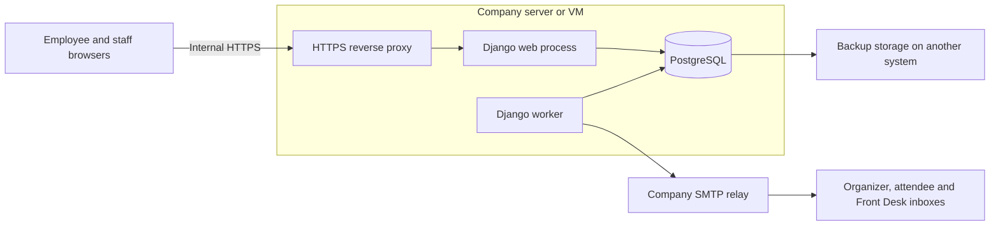

# Meeting Room Booking System — architecture

**Status:** Application implemented and tested locally. Private-network production rollout awaits the IT server, TLS certificate, SMTP relay, real room records, and pilot acceptance. The detailed schema is in [database design](database-design.md).

**Sources:** Meeting Room Booking System Requirements Questionnaire (23 September 2026) and the project owner's answers in this conversation (28 September 2026). The questionnaire supplies stakeholder requirements; the owner's answers resolve or amend them.

## Purpose and launch scope

An internal web application lets approximately 90–95 employees reserve five company meeting rooms without overlapping reservations. It includes daily and weekly availability, searchable room details and facilities, one-time email sign-in, profiles, individual and recurring bookings, employee changes and cancellations, email check-in, automatic cancellation after a missed check-in deadline, Front Desk management, room closures, email notifications, basic reports with Excel export, and audit history. Staff have a month view and searchable, paginated booking/user/audit lists. Direct HCL/Outlook calendar integration will follow the first launch.

Bookings use Nepal Standard Time for display. The initial rules from the questionnaire are Monday–Friday, 9:00–17:00, on working days; 30–120 minutes per meeting; 15-minute start/end increments; bookings up to two weeks ahead, including recurring occurrences; and a 15-minute gap between meetings. Employees open a secure email link and confirm check-in before the deadline, 15 minutes after the meeting starts. Rules must be configurable by authorized staff, with changes audited. Booking history and audit records are retained for at least one year, subject to the company's final retention policy.

## Architecture

**Single application.** Django renders employee and staff screens and enforces permissions and booking rules. One repository contains the web app and worker. PostgreSQL holds application records, sessions, and pending notification jobs. This is an appropriate starting architecture for five rooms and approximately 95 employees; capacity still needs pilot verification.

**One conflict model.** PostgreSQL is confirmed. Both meeting occurrences and maintenance closures reserve time through the same database relation so that one exclusion constraint protects against conflicts between either type. The shared write path locks the room row, checks availability, and writes in a transaction; a conflicting concurrent write returns an availability error. Later staff workflows must use that same write path. PostgreSQL documents exclusion constraints specifically for non-overlapping room reservations. [PostgreSQL range constraints](https://www.postgresql.org/docs/current/rangetypes.html#RANGETYPES-CONSTRAINT)

**Time and buffers.** Store timezone-aware timestamps as UTC instants and apply working hours and recurrence rules in `Asia/Kathmandu`. Store meeting times separately from the occupied interval. Count the 15-minute gap once: a meeting from 10:00 to 11:00 reserves the room until 11:15, so another meeting may start at 11:15. Front Desk can add a room closure for extra preparation time. A rule change does not rewrite existing occupied intervals.

**Finite recurring bookings.** Expand a recurring request into actual occurrences inside the two-week horizon, with a shared series identifier. Initial series creation is one transaction: either all requested occurrences are saved or the user receives an availability error. Later monthly dates are booked manually, as agreed. A monthly pattern within two weeks ordinarily produces only one occurrence. Recurrence does not require an ongoing process to reserve future dates.

**Manual priority.** Front Desk will decide when senior management receives priority for the WDN third-floor room. If staff must move or cancel an existing booking, that change must be audited and the affected organizer notified. Staff cannot bypass the database conflict constraint and leave two active bookings for the same room and time.

**Email identity and privacy.** Employees use expiring, single-use links sent only to `wdn.com.np`. Token records and pending session values contain hashes; raw links are needed in queued email bodies until delivery, so database and backup access must be restricted. Request logs omit token URLs and sensitive values. Atomic database throttles limit account and client-IP requests independently; only the known proxy may supply client-IP headers. Login tokens and check-in tokens have separate purposes; an occurrence's check-in link only authorizes check-in for that occurrence. Rescheduling or cancelling invalidates its old check-in link. Employee availability shows room and time but hides attendee lists, notes, meeting titles, and purpose from other employees. Every detail view and change requires server-side authorization.

**Safe use of email links.** Opening a link displays a confirmation page; a deliberate button press performs login or check-in using a protected POST request. Merely fetching or previewing a URL must not consume the token or check in a meeting. This also reduces accidental actions from email link inspection. Django requires safe HTTP methods such as GET to be free of state-changing actions. [Django CSRF guidance](https://docs.djangoproject.com/en/5.2/ref/csrf/)

**Staff privileges.** Front Desk and Administrators have identical permissions through one staff role, with individual named accounts for auditability. Staff sign-in requires a password and an eight-digit one-time code sent to the company mailbox. Guess counts are persisted and locked, and codes are bound to the current password/access version. If a staff member uses the employee email-link route, that session has employee capabilities only. Staff endpoints check the stronger session flag and current authentication version. Access changes invalidate all of the affected person's sessions and pending sign-in challenges, including after deactivation/reactivation. Profiles may change only names and department.

**Email delivery.** A booking change, its audit event, and pending notifications commit in the same database transaction. The worker sends organizer, attendee, and Front Desk emails and one-hour reminders. Organizer confirmation, change, and reminder emails include check-in links. Failed delivery is logged and retried up to five attempts without reversing the booking; interrupted leases recover after restart. The worker rechecks booking state before sending and labels obsolete messages superseded. Disabled SMTP leaves jobs pending without consuming retries, and authentication reports delivery unavailable. Only backend acceptance marks a message sent. SMTP retries can occasionally duplicate emails after an ambiguous delivery result. SMTP configuration and secrets are supplied later through environment configuration.

**Check-in and automatic cancellation.** Check-in and no-show cancellation must use the same transactional locking and status checks. Re-read the current start time, deadline, and status after locking the booking so that a concurrent edit or check-in cannot be overwritten. At or after the deadline, an unchecked booking is cancelled with reason `no_show`, its room reservation is released, and the audit event and cancellation emails are saved atomically. The history remains available for reports. Check-in after the deadline is rejected even if the scheduled job has not yet run.

**Worker.** One Docker-managed Django worker reconciles every 30 seconds: it releases overdue no-shows, marks finished meetings, and queues reminders. It sends one due email at a time between reconciliations, with a ten-second SMTP timeout. Booking writes also reconcile overdue no-shows. Calendar GET requests retain occupied intervals until the database actually releases them and mark past, closed, holiday, or out-of-window starts unavailable. Release happens on the next successful reconciliation, with a slow send adding up to one timeout. Worker success is recorded in a singleton heartbeat. Readiness requires a successful cycle within two minutes; IT monitoring must alert on stale heartbeats and unhealthy containers.

**Deployment and recovery.** One company Linux server or VM hosts Docker Compose services for Nginx HTTPS, Gunicorn, the worker, and PostgreSQL. All application services share one image, avoiding stale migration code. Web and worker run as a non-root user with read-only filesystems. PostgreSQL and web expose no host ports. Migrations and role setup use the database administrator; runtime uses a separate role without superuser, database/role/schema creation, or audit update/delete permissions. The proxy resolves recreated web container addresses through Docker DNS. Internal URLs and email links are reachable only from the company network or approved VPN. SMTP failure affects new sign-ins and check-in-link delivery; Front Desk sees failed mail and has manual check-in during the valid window. Use HTTPS and production settings even on the private network. [Django deployment checklist](https://docs.djangoproject.com/en/5.2/howto/deployment/checklist/)

**Browser and operational safety.** Server-side forms use CSRF protection and escaped templates. Secure production cookies, a same-origin content security policy, frame denial, and no-store caching protect signed-in pages. Excel export treats user input as literal text. Unexpected errors show branded safe pages; database failures return 503 without exposing connection details. Room/filter queries prefetch facilities, calendar rows group reservations once, and large management lists paginate.

**Reports.** Utilization clips checked-in/completed meeting intervals to the configured working calendar and subtracts the union of room closures. Cancelled/no-show meetings and preparation gaps do not count as used meeting time. Results use the current holiday/policy settings, so historical changes can alter the denominator. Reports are operational estimates, not historical policy reconstruction.

The single server is a shared point of failure. IT must agree acceptable downtime and data loss, provide scheduled backups on another system, and test restore before rollout. Monitor application health, scheduled-job freshness, failed mail, database/storage availability, and backup completion. This provides a recoverable initial installation; uninterrupted service would require additional infrastructure. Pin supported software versions, keep migrations in source control, and document upgrades and recovery.

## Main user journeys

1. An employee selects a room and slot, requests an email sign-in link, verifies ownership of the company address, enters meeting details, and confirms. The slot is rechecked when saving; selection alone does not reserve it.
2. The application validates the rules and saves the booking only if PostgreSQL accepts the occupied interval. It queues confirmation emails in the same transaction.
3. For a recurring series, the application expands occurrences within the two-week window, checks every occurrence, and commits them in one transaction if every slot is valid. The organizer books later monthly occurrences manually; the system will not automatically reserve dates beyond two weeks.
4. The organizer opens a secure email link and presses the check-in button before the deadline. If no valid check-in occurs within 15 minutes after the scheduled start, the booking is automatically cancelled using the deadline and scheduling behavior described above.
5. Front Desk staff see full booking and preparation details and may manage bookings and room closures. Employees see only limited information about others' bookings.

## Operational inputs still needed

1. Employee name/department source, official holiday calendar, five room records, and exact WDN third-floor priority procedure. Only `wdn.com.np` employee email addresses are allowed for now. Front Desk will handle room priority manually; the workflow still needs definition.
2. Server access, internal hostname and certificate, SMTP relay details, and backup policy. Staff password plus email code has been approved.

## Acceptance checks before rollout

The pilot must demonstrate verified employee ownership; authorization of changes and private details; prevention of staff-MFA bypass through employee login; normal and recurring bookings; simultaneous requests for one slot; conflicts between bookings and room closures; exact buffer boundaries; email confirmation/change/cancellation/reminder; failed email retry without lost bookings; safe email-link previews; check-in racing against cancellation or rescheduling; scheduled-job restart and recovery; Front Desk operations; accurate basic reports; audit records; and a tested database restore. Representative concurrent usage must be tested on the chosen deployment configuration. IT and management will review the results before company-wide rollout.

SMTP/email credentials must be supplied by the system administrator during production deployment. No production email credentials are included in this repository.
