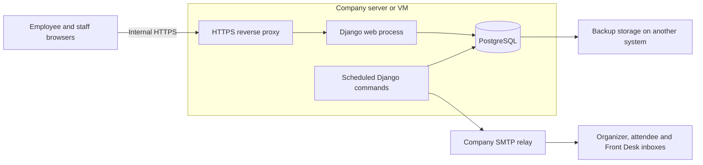

# Meeting Room Booking System — architecture draft

**Status:** Architecture baseline for incremental development. The database and Docker foundation are implemented; employee workflows and production deployment remain to be built and tested. The detailed schema is in [database design](database-design.md).

**Sources:** Meeting Room Booking System Requirements Questionnaire (23 September 2026) and the project owner's answers in this conversation (28 September 2026). The questionnaire supplies stakeholder requirements; the owner's answers resolve or amend them.

## Purpose and launch scope

An internal web application will let approximately 90–95 employees reserve five company meeting rooms without overlapping reservations. The first launch includes daily and weekly availability, room details and capacity filtering, one-time email sign-in, individual and recurring bookings, employee changes and cancellations, email check-in, automatic cancellation after a missed check-in deadline, Front Desk management, room closures, email notifications, basic reports with Excel export, and audit history. A staff month view and reporting needed for Front Desk planning are included. Direct HCL/Outlook calendar integration will follow the first launch.

Bookings use Nepal Standard Time for display. The initial rules from the questionnaire are Monday–Friday, 9:00–17:00, on working days; 30–120 minutes per meeting; 15-minute start/end increments; bookings up to two weeks ahead, including recurring occurrences; and a 15-minute gap between meetings. Employees open a secure email link and confirm check-in before the deadline, 15 minutes after the meeting starts. Rules must be configurable by authorized staff, with changes audited. Booking history and audit records are retained for at least one year, subject to the company's final retention policy.

## Architecture

**Single application.** A Django/Python application will render the employee and staff screens, enforce permissions and booking rules, and provide the endpoints needed by the calendar. The interface uses server-rendered pages with focused JavaScript. One code repository contains the web application and scheduled commands, with modules for identity, rooms, bookings, notifications, and reporting. PostgreSQL holds application records, sessions, and pending notification jobs. This is an appropriate starting architecture for five rooms and approximately 95 employees; capacity will be verified during pilot testing.

**One conflict model.** PostgreSQL is confirmed. Both meeting occurrences and maintenance closures reserve time through the same database relation so that one exclusion constraint protects against conflicts between either type. The shared write path locks the room row, checks availability, and writes in a transaction; a conflicting concurrent write returns an availability error. Later staff workflows must use that same write path. PostgreSQL documents exclusion constraints specifically for non-overlapping room reservations. [PostgreSQL range constraints](https://www.postgresql.org/docs/current/rangetypes.html#RANGETYPES-CONSTRAINT)

**Time and buffers.** Store timezone-aware timestamps as UTC instants and apply working hours and recurrence rules in `Asia/Kathmandu`. Store meeting times separately from the occupied interval. Count the 15-minute gap once: a meeting from 10:00 to 11:00 reserves the room until 11:15, so another meeting may start at 11:15. Explicit additional setup/cleanup must also be included in the occupied interval. A rule change must not silently alter existing occupied intervals and introduce conflicts.

**Finite recurring bookings.** Expand a recurring request into actual occurrences inside the two-week horizon, with a shared series identifier. Initial series creation is one transaction: either all requested occurrences are saved or the user receives the conflict list. Later monthly dates are booked manually, as agreed. The preview must show which dates will actually be reserved; a monthly pattern within two weeks ordinarily produces only one occurrence. Recurrence does not require an ongoing process to reserve future dates.

**Manual priority.** Front Desk will decide when senior management receives priority for the WDN third-floor room. If staff must move or cancel an existing booking, that change must be audited and the affected organizer notified. Staff cannot bypass the database conflict constraint and leave two active bookings for the same room and time.

**Email identity and privacy.** Employees use expiring, single-use links sent only to approved company email domains. Store token hashes, limit repeated requests, and keep tokens out of logs. Login tokens and check-in tokens have separate purposes; an occurrence's check-in link only authorizes check-in for that occurrence. Rescheduling or cancelling invalidates its old check-in link. Employee availability shows room and time but hides attendee lists, notes, meeting titles, and purpose from other employees. Every detail view and change requires server-side authorization.

**Safe use of email links.** Opening a link displays a confirmation page; a deliberate button press performs login or check-in using a protected POST request. Merely fetching or previewing a URL must not consume the token or check in a meeting. This also reduces accidental actions from email link inspection. Django requires safe HTTP methods such as GET to be free of state-changing actions. [Django CSRF guidance](https://docs.djangoproject.com/en/5.2/ref/csrf/)

**Staff privileges.** Front Desk and Administrators have identical permissions through one staff role, with individual named accounts for auditability. Passwords with TOTP MFA remain the proposed staff login method, subject to IT's identity policy. If a staff member uses an employee email login, that session receives employee capabilities only; staff operations must additionally require the approved staff authentication strength. Otherwise, the employee login route could bypass staff MFA.

**Email delivery.** Save a booking change, its audit event, and its pending notification records in the same database transaction. Scheduled commands from the same application send organizer, attendee, and Front Desk emails and one-hour reminders. A failed send is logged and retried without reversing the booking. Jobs need bounded SMTP timeouts, retry limits, and visible failure status. Before sending a reminder, recheck the current booking status and time. SMTP retries can occasionally produce duplicate emails after an ambiguous delivery result; delivery is not promised to be exactly once. SMTP configuration and secrets are supplied later through environment configuration.

**Check-in and automatic cancellation.** Check-in and no-show cancellation must use the same transactional locking and status checks. Re-read the current start time, deadline, and status after locking the booking so that a concurrent edit or check-in cannot be overwritten. At or after the deadline, an unchecked booking is cancelled with reason `no_show`, its room reservation is released, and the audit event and cancellation emails are saved atomically. The history remains available for reports. Check-in after the deadline is rejected even if the scheduled job has not yet run.

**Small scheduled jobs.** Use operating-system-managed Django commands for due bookings/reminders and for SMTP delivery. Run them independently so slow email delivery cannot hold up cancellation. A proposed initial schedule checks due bookings every minute; under normal operation, stored cancellation and notifications follow within the next pass, rather than being guaranteed at the exact second. Availability and booking operations also reconcile relevant overdue bookings so an expired reservation cannot block a new booking while waiting for that pass. Commands must be safe to repeat, prevent duplicate job claims, and record their last successful run for monitoring. Service restart and overdue-work recovery are required.

**Deployment and recovery.** One company server or VM can initially host the HTTPS reverse proxy, production Django web process, scheduled commands, and PostgreSQL. The chosen OS will determine the service configuration; on Linux, a conventional option is Nginx, Gunicorn, and systemd. Database access is limited to the application and approved administration paths. Internal URLs and email links are reachable only from the company network or an approved VPN. SMTP failure affects new email sign-ins and check-in-link delivery; Front Desk needs visibility of failed messages and its manual check-in capability. Use HTTPS and production settings even on the private network. [Django deployment checklist](https://docs.djangoproject.com/en/5.2/howto/deployment/checklist/)

The single server is a shared point of failure. IT must agree acceptable downtime and data loss, provide scheduled backups on another system, and test restore before rollout. Monitor application health, scheduled-job freshness, failed mail, database/storage availability, and backup completion. This provides a recoverable initial installation; uninterrupted service would require additional infrastructure. Pin supported software versions, keep migrations in source control, and document upgrades and recovery.

## Main user journeys

1. An employee selects a room and slot, requests an email sign-in link, verifies ownership of the company address, enters meeting details, and confirms. The slot is rechecked when saving; selection alone does not reserve it.
2. The application validates the rules and saves the booking only if PostgreSQL accepts the occupied interval. It queues confirmation emails in the same transaction.
3. For a recurring series, the application expands occurrences within the two-week window, checks every occurrence, and commits them in one transaction if every slot is valid. The organizer books later monthly occurrences manually; the system will not automatically reserve dates beyond two weeks.
4. The organizer opens a secure email link and presses the check-in button before the deadline. If no valid check-in occurs within 15 minutes after the scheduled start, the booking is automatically cancelled using the deadline and scheduling behavior described above.
5. Front Desk staff see full booking and preparation details and may manage bookings and room closures. Employees see only limited information about others' bookings.

## Operational inputs still needed

1. Employee name/department source, official holiday calendar, five room records, and exact WDN third-floor priority procedure. Only `wdn.com.np` employee email addresses are allowed for now. Front Desk will handle room priority manually; the workflow still needs definition.
2. Server OS and deployment permissions, internal domain/certificate, SMTP relay details, backup policy, and IT's staff sign-in/MFA policy.

## Acceptance checks before rollout

The pilot must demonstrate verified employee ownership; authorization of changes and private details; prevention of staff-MFA bypass through employee login; normal and recurring bookings; simultaneous requests for one slot; conflicts between bookings and room closures; exact buffer boundaries; email confirmation/change/cancellation/reminder; failed email retry without lost bookings; safe email-link previews; check-in racing against cancellation or rescheduling; scheduled-job restart and recovery; Front Desk operations; accurate basic reports; audit records; and a tested database restore. Representative concurrent usage must be tested on the chosen deployment configuration. IT and management will review the results before company-wide rollout.
