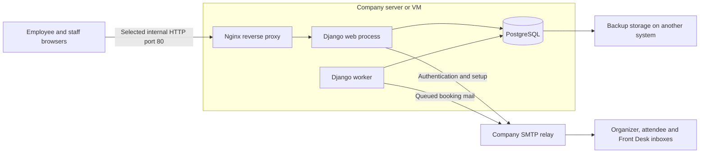

# Meeting Booking System — architecture

**Transgate Tech | Binayak Bhandari**

**Status:** Implementation verified with 323 PostgreSQL tests (8 October 2026) and isolated browser/deployment/restore rehearsals. The owner has installed company services on Oracle Linux 9.8 at `192.168.50.222` using `compose.prod.http.yaml` and `http://mbs.wdn.com.np`. HTTP was explicitly selected; no certificate is part of this installation. Actual device access, relay/mailbox delivery, records, backups and pilot acceptance must be checked on the company installation. Start with the [documentation index](index.md); schema is in [database design](database-design.md).

**Sources:** Meeting Room Booking System Requirements Questionnaire (23 September 2026) and the project owner's answers in this conversation, including the production approval workflow (7 October 2026) and configurable per-room approval and attendee meeting visibility/directory/professional email (8 October 2026). The questionnaire supplies stakeholder requirements; the owner's answers resolve or amend them.

## Purpose and launch scope

An internal web application lets approximately 90–95 employees reserve five company meeting rooms without overlapping reservations. It includes daily and weekly availability, searchable room details and facilities, optional authenticated room photos, one-time email sign-in, profiles, organized/invited My meetings with read-only attendee access, employee directory suggestions, a three-step booking wizard with real whole-series availability, internal/external/mixed meetings, individual and recurring bookings, employee changes and cancellations, email check-in, automatic cancellation after a missed check-in deadline, Front Desk management, room closures, email notifications, basic reports with Excel export, and audit history. All signed-in users have room-filtered Month/Week/Day calendars with privacy-aware event cards and date navigation. Staff have searchable, paginated booking/user/audit lists. Direct HCL/Outlook calendar integration will follow the first launch.

Bookings use Nepal time. Initial configurable defaults are Monday-Friday, 09:00-17:00 excluding configured holidays; 30-120 minute meetings; 15-minute increments/gap; and a 14-day horizon including recurrence. Check-in is allowed from start until before the current deadline, initially 15 minutes later. Staff policy changes are audited. History has no automatic purge; the requested minimum one-year retention and company backup/retention arrangements remain operational decisions.

## Architecture

**Single application.** Django renders employee and staff screens and enforces permissions and booking rules. One repository contains the web app and worker. PostgreSQL holds application records, sessions, and pending notification jobs. This is an appropriate starting architecture for five rooms and approximately 95 employees; capacity still needs pilot verification.

**Booking interface and preview.** Server-rendered fields remain the authoritative POST contract. JavaScript stages Schedule & details, Attendees and Review & confirm, derives duration/start choices from current policy, and fetches a read-only authenticated availability endpoint. Preview and creation share schedule/recurrence expansion, including holiday skips and stored occupied intervals; edit excludes only the authorized occurrence. The endpoint returns room metadata and occupied ranges without other meeting titles/emails/notes. Selecting a room does not reserve it; final writes recheck under database locks. Native form fallback retains the same server validation when JavaScript is unavailable. External and mixed meetings require guest company information.

**Room photos.** Verified staff upload, replace or remove optional still photos through room management. Files are decoded/re-encoded as bounded JPEGs with generated names; supplied metadata is discarded. Authenticated delivery serves active room photos to employees and inactive rooms to verified staff, with no public media server. Database stores filenames; the web-only named `room_media` volume stores bytes under `/app/media/rooms/photos`. Normalized upload files belong to UID/GID 1000. Replaced/removed files are deleted after the room transaction commits. Recovery pairs a database snapshot with its photo archive.

**One conflict model.** PostgreSQL is confirmed. Both meeting occurrences and maintenance closures reserve time through the same database relation so that one exclusion constraint protects against conflicts between either type. The shared write path locks the room row, checks availability, and writes in a transaction; a conflicting concurrent write returns an availability error. Later staff workflows must use that same write path. PostgreSQL documents exclusion constraints specifically for non-overlapping room reservations. [PostgreSQL range constraints](https://www.postgresql.org/docs/current/rangetypes.html#RANGETYPES-CONSTRAINT)

**Time and buffers.** Store timezone-aware timestamps as UTC instants and apply working hours and recurrence rules in `Asia/Kathmandu`. Store meeting times separately from the occupied interval. Count the 15-minute gap once: a meeting from 10:00 to 11:00 reserves the room until 11:15, so another meeting may start at 11:15. Front Desk can add a room closure for extra preparation time. A rule change does not rewrite existing occupied intervals.

**Room approval policy.** `Room.requires_approval` defaults to true, including existing rooms after migration 0011. Verified staff manage it through the room list checkbox or add/edit form. Employee creations and substantive edits in a checked room become Pending; in an unchecked room they become Approved automatically. Both states participate in the same occupancy/exclusion constraint as closures. Saving reads the selected room's current policy under its row lock; browser flags cannot select a status or bypass rules. Automatic approval has a timestamp but no fabricated reviewer. Staff creations are Approved; staff edits retain Approved, while substantive edits to Pending in an unchecked room can confirm it. Unchanged saves and room-policy toggles leave saved statuses intact.

**Staff review.** Verified staff approve a future Pending request or reject it with a visible reason. Both transitions lock the current room and reservation, revalidate state and permissions, update audit metadata, and queue mail atomically. Rejected/cancelled requests release occupancy. Pending requests expire at the meeting start and cannot check in. Approval cannot revive rejected/cancelled/expired records. Recurring creations use the room policy for every occurrence; Pending occurrences are reviewed separately. Turning off review does not bulk-approve the existing queue or demote approved records when turned back on.

**Finite recurring bookings.** Expand a recurring request into actual occurrences inside the two-week horizon, with a shared series identifier. Initial series creation is one transaction: either all requested occurrences are saved or the user receives an availability error. Later monthly dates are booked manually, as agreed. A monthly pattern within two weeks ordinarily produces only one occurrence. Recurrence does not require an ongoing process to reserve future dates.

**Manual priority.** Front Desk will decide when senior management receives priority for the WDN third-floor room. If staff must move or cancel an existing booking, that change must be audited and the affected organizer notified. Staff cannot bypass the database conflict constraint and leave two active bookings for the same room and time.

**Email identity and privacy.** Employee links use `wdn.com.np` or `transgate.com.np`; token records and pending session values contain hashes. Organizer check-in links are generated for outgoing mail during delivery, not persisted in notification body snapshots. Outbox records still contain sensitive recipient/meeting content; restrict database/backup access. Safe logs omit private links and request values. Database throttles apply to account/IP; only the configured proxy supplies trusted IP headers. Login and check-in tokens have separate purposes. A check-in token authorizes only its occurrence and needs no prior employee login; edits/cancellation invalidate old links. Unrelated employees cannot see titles, purpose, attendees or notes. Current saved attendees can read their meeting details, dashboard/calendar entry and My meetings record; removal ends that access. Detail reads authorize organizer, case-insensitive attendee email, or verified staff, while changes/cancellation remain organizer or verified staff. The suggestion endpoint exposes only up to eight active approved-domain email/name matches for a two-character prefix, under authenticated GET and no-store caching.

**Safe use of email links.** Opening a link displays a confirmation page; a deliberate button press performs login or check-in using a protected POST request. Merely fetching or previewing a URL must not consume the token or check in a meeting. This also reduces accidental actions from email link inspection. Django requires safe HTTP methods such as GET to be free of state-changing actions. [Django CSRF guidance](https://docs.djangoproject.com/en/5.2/ref/csrf/)

**Staff privileges.** Front Desk and Administrators have identical permissions through one staff role, with individual named accounts for auditability. Staff sign-in requires a password and an eight-digit one-time code sent to the company mailbox. Guess counts are persisted and locked, and codes are bound to the current password/access version. If a staff member uses the employee email-link route, that session has employee capabilities only. Staff endpoints check the stronger session flag and current authentication version. Access changes invalidate all of the affected person's sessions and pending sign-in challenges, including after deactivation/reactivation. Profiles may change only names and department.

**Department catalog.** Migration 0012 creates a case-insensitively unique, staff-managed `Department` table and seeds the eight agreed options plus existing nonblank department labels. Booking, My profile and staff People use dropdowns validated against active choices. Existing records may retain their own current legacy/inactive label during edits; new bookings use active options only. User/reservation department strings remain snapshots, so catalog renaming/deactivation does not rewrite history or report groups. Verified staff add/edit/deactivate departments with audited changes; no additional role, environment variable or service is introduced.

**Email delivery.** Authentication and booking events use branded multipart HTML/plain-text messages. Clear event/state headings and meeting summaries use Nepal time; eligible organizer mail includes a Check in action opening the existing confirmation flow, while attendee mail contains no check-in token. Current eligible employee participants and active staff recipients get View meeting. External guests and former participants with neither current participation nor active staff access get Contact organizer; the intentional change notice does not restore read access or promise an eligible employee session. HTML templates escape user text and use a bundled inline CID wordmark, avoiding remote image/tracking requests. Existing text/event snapshots remain; HTML renders at delivery under current lease/revision/status checks, without a notification-schema migration. Reservation changes, audit and outbox jobs commit together. Worker delivers booking events and one-hour reminders; pending-request/rejection notices omit attendees. Eligible organizer confirmation/change/reminder mail includes check-in links. Failures allow five attempts; leases recover interruptions. Current state/revision supersedes obsolete jobs. Disabled SMTP preserves retries and blocks authentication email. Backend acceptance does not prove inbox arrival, and ambiguous outcomes can duplicate mail. Selected relay is `maildc01.wdn.com.np:25`, sender `mbs@wdn.com.np`, no relay AUTH/TLS/SSL; verify the deployed source and actual receipt. See [email operations](operations-runbook.md#7-worker-and-notification-operations).

**Check-in and automatic release.** Check-in/release use transactional locks and current-state checks. After the deadline an unchecked approved booking becomes `no_show`, releases occupancy and records audit/no-show mail together. History remains; late check-in fails even before reconciliation runs. Pending requests cannot check in and expire at their start.

**Worker.** One Docker-managed Django worker reconciles every 30 seconds: it cancels expired pending requests, releases overdue no-shows, marks finished meetings, and queues reminders. It sends one due email at a time between reconciliations, with a ten-second SMTP timeout. Booking writes also reconcile expired pending requests and overdue no-shows. Calendar GET requests retain occupied intervals until the database actually releases them and mark past, closed, holiday, or out-of-window starts unavailable. Release happens on the next successful reconciliation, with a slow send adding up to one timeout. Worker success is recorded in a singleton heartbeat. Readiness requires a successful cycle within two minutes; IT monitoring must alert on stale heartbeats and unhealthy containers.

**Deployment and recovery.** One company server hosts Nginx, Gunicorn, worker and PostgreSQL. Selected HTTP publishes only `192.168.50.222:80`; an alternative HTTPS profile remains available for a future planned change. Both force production safeguards. App services share one image; web/worker are non-root with read-only application filesystems, and web mounts a writable persistent photo volume. Web/DB publish no host port. Migration/setup use administrator credentials; runtime has no superuser, database/role/schema creation or audit update/delete privileges. Nginx resolves recreated web addresses through Docker DNS. IT restricts office/VPN access. SMTP failure affects authentication/check-in-link delivery; staff can manually check in within the valid window. [Operations/recovery](operations-runbook.md) covers backups, restore drills and updates.

**Browser and operational safety.** Forms use CSRF and escaped templates. Session cookies are HttpOnly/SameSite Lax; Secure is transport-dependent and false in the selected HTTP profile. Same-origin referrer policy supports native form origin checks. Content security policy, frame denial and no-store caching apply; Excel treats user text literally. Branded safe errors/logs omit secrets; unavailable databases return 503. Rooms prefetch facilities, calendars group reservations and management lists paginate. The admin interface is custom `/staff/`, with no configured `/admin/` route.

**Reports.** Utilization clips checked-in/completed meeting intervals to the configured working calendar and subtracts the union of room closures. Cancelled/no-show meetings and preparation gaps do not count as used meeting time. Results use the current holiday/policy settings, so historical changes can alter the denominator. Reports are operational estimates, not historical policy reconstruction.

The single server is a shared point of failure. IT must agree acceptable downtime and data loss, provide scheduled backups on another system, and test restore before rollout. Monitor application health, scheduled-job freshness, failed mail, database/storage availability, and backup completion. This provides a recoverable initial installation; uninterrupted service would require additional infrastructure. Pin supported software versions, keep migrations in source control, and document upgrades and recovery.

## Main user journeys

1. An employee requests an email sign-in link, verifies ownership of the company address, then follows Schedule & details → Attendees → Review & confirm. The wizard checks every proposed occurrence and room capacity before submission. The slot is rechecked when saving; selection alone does not reserve it.
2. Saving rechecks policy/occupancy atomically. A checked room creates Pending employee holds/request notices; staff review each occurrence. An unchecked room creates Approved employee meetings/confirmation immediately. Staff-created bookings start Approved for either policy. Manual approval also queues confirmation; rejection requires a reason and frees occupancy.
3. For a recurring series, the application expands occurrences within the two-week window, checks every occurrence, and commits them in one transaction if every slot is valid. The organizer books later monthly occurrences manually; the system will not automatically reserve dates beyond two weeks.
4. The organizer opens the private email link and presses the check-in button before the configured deadline (initially 15 minutes after start). An unchecked Approved meeting becomes No show and releases occupancy; history remains.
5. Front Desk staff see full booking and preparation details and may manage bookings and room closures. Employees read meetings they organize or attend; unrelated employees see only occupied slots. The attendee directory helps select registered colleagues without granting management rights.

## Current installation and remaining decisions

1. Employee name/department source, official holiday calendar, five room records, and exact WDN third-floor priority procedure. Employee email addresses must use `wdn.com.np` or `transgate.com.np`. Front Desk will handle room priority manually; the workflow still needs definition.
2. Server OS/IP/domain and HTTP choice are known; the owner supplied Docker startup/health logs. The selected relay previously accepted a test. IT still verifies deployed-server relay permission/mailbox receipt, device DNS/routing, backup destination/retention/recovery objectives and monitoring. Staff password plus email code is approved. No certificate is required for selected HTTP.

## Acceptance checks before rollout

The pilot must demonstrate verified employee ownership; authorization of changes and private details; prevention of staff-MFA bypass through employee login; pending, approved, rejected, cancelled, and recurring bookings; simultaneous requests for one slot; conflicts between bookings and room closures; exact buffer boundaries; email confirmation/change/cancellation/reminder; failed email retry without lost bookings; safe email-link previews; check-in racing against cancellation or rescheduling; scheduled-job restart and recovery; Front Desk operations; accurate basic reports; audit records; and a tested database restore. Representative concurrent usage must be tested on the chosen deployment configuration. IT and management will review the results before company-wide rollout.

See [features/use cases](features-and-use-cases.md) for business definitions/limits and [verification evidence](verification-report.md) for tests versus office acceptance. No production credentials are included in this repository.
