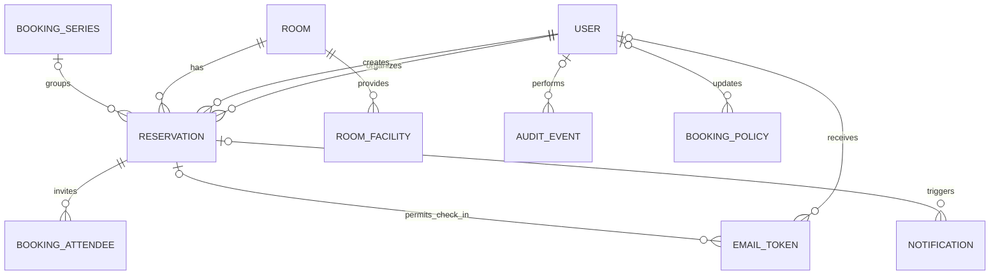

# Database design

**Transgate Tech | Binayak Bhandari**

The application uses PostgreSQL. Each meeting occurrence and room closure reserves time in the same `reservations` table, allowing one database constraint to reject overlapping occupied periods for a room. All displayed booking times use `Asia/Kathmandu`; timestamps are stored as timezone-aware instants. Booking screens, email delivery, check-in jobs, and staff workflows use this schema.

## ERD

## Photo files and database boundaries

`rooms.photo` stores an optional generated filename, not image bytes. Normalized JPEG files live under `/app/media/rooms/photos` in the web container's persistent `room_media` volume. Photo replacement/removal is tied to the database commit; after successful replacement the former file is removed. Migration `0010_room_photo` adds this optional field without seeding/resetting existing rooms. Database backups must be paired with photo archives from the same recovery point; a database dump alone cannot restore file contents. See [photo backup and recovery](operations-runbook.md#room-photo-backup-and-recovery).

## Tables and keys

| Table | Key fields and relationships | Purpose |
| --- | --- | --- |
| `users` | `id` PK; `email` unique including case-insensitive constraint; `is_staff`, `is_active`, `auth_version`; name and department | One identity per company address. Authentication version participates in the session hash and invalidates existing sessions when access changes. |
| `rooms` | `id` PK; unique `(location, floor, name)`; capacity, description, instructions, optional photo filename, active flag, `requires_approval` default true | Company-configured rooms managed through staff controls; production does not seed sample records. Inactive rooms cannot receive new bookings. |
| `room_facilities` | `id` PK; `room_id` FK; unique `(room_id, name)` | Room equipment and facilities. A simple room-specific list is sufficient for five rooms. |
| `booking_series` | `id` PK; `room_id`, `organizer_id`, `created_by_id` FKs; frequency, first/last dates | Groups the actual occurrences of a daily, weekly, or monthly request within the two-week advance window. It is not a promise to reserve later dates. |
| `reservations` | `id` PK; `room_id` FK; optional `series_id`, `organizer_id`, `created_by_id` FKs; kind, status, meeting type, guest company, approval/rejection actor/timestamp/reason, revision, actual start/end, occupied start/end | Shared schedule for meetings and staff room closures. A meeting has organizer and title; a closure has a reason. Rejected, cancelled, and no-show meetings remain in history but release occupancy. |
| `booking_attendees` | `id` PK; `reservation_id` FK; unique `(reservation_id, email)` | Email recipients, attendee count and read-only meeting access for a signed-in matching email. Only meeting reservations may have attendees. |
| `email_tokens` | `id` PK; optional `user_id`, `reservation_id` FKs; token hash unique, purpose, expiry, consumed time, attempts | Short-lived employee login, staff email code, or per-occurrence check-in. This table and pending session values store hashes. Staff challenge guesses are counted under a row lock. |
| `authentication_throttles` | `id` PK; unique `(purpose, key)`; window start, attempts | Atomic account/IP limits with HMAC identity keys and indexed request windows. |
| `notifications` | `id` PK; optional `reservation_id` FK; recipient, event type, reservation revision, content snapshot, status, attempts, next attempt, lease UUID/expiry | Database outbox for email delivery and retries. Snapshots contain sensitive meeting/recipient data; restrict access. Check-in links are generated for outgoing delivery, not persisted in snapshots. Status distinguishes pending/sending/sent/failed/skipped (Superseded). Leases recover interrupted delivery. |
| `audit_events` | `id` PK; optional `actor_id` FK; action, target, outcome, timestamp, safe details | Append-only application history, including system actions. No passwords, raw tokens, or SMTP secrets. |
| `booking_policy` | Singleton `id=1` PK; working hours, limits, slot size, gap, check-in deadline; optional `updated_by_id` FK | Configurable company-wide booking rules. Application logic validates rules on every write and records staff changes. |
| `company_holidays` | `id` PK; date unique, name | The official non-bookable working calendar, with staff exceptions recorded on affected reservations. |
| `worker_heartbeat` | Singleton `id=1` PK; last successful cycle and last error timestamps | Worker readiness and restart/failure monitoring without exposing exception details. |
| Django session/auth tables | Django-managed session key/expiry/data and inherited authentication relations | Database sessions with hashed pending tokens; passwords use Django's password hashers. No external SSO or public REST API is required. |

There is no separate `roles` table because the confirmed application has exactly two permission levels: employee and staff. Django's `is_staff` flag identifies the shared Front Desk/Administrator level. Its built-in superuser flag is reserved for technical administration. A separate role catalog can be introduced if the business later requires distinct staff permissions.

## Reservation state and validation

`kind=booking` permits `pending`, `approved`, `rejected`, `checked_in`, `completed`, `cancelled`, or `no_show`. `kind=block` permits `blocked` or `block_cancelled`. The database checks the kind/status pairing and requires the appropriate meeting or closure fields. Meeting start precedes end, and the occupied interval contains the meeting interval. A normal meeting reserves from `starts_at` through `ends_at + configured gap`. A closure uses its own specified interval. Pending and approved requests hold occupancy. Checked-in/completed meeting occupancy remains in historical conflict checks; rejected/cancelled/no-show/withdrawn closures release it. Rejection requires a nonempty reason. Approval/rejection metadata and a reservation revision record review and invalidate stale queued mail. Policy bounds, room capacity, series date ordering, and token purpose/target also have database checks.

The first migration enables PostgreSQL's `btree_gist` extension. An exclusion constraint on `(room_id equality, tstzrange(occupied_from, occupied_until, '[)') overlap)` applies to active statuses. This rejects concurrent double booking and conflicts between a booking and a closure. Adjacent intervals may meet at the boundary, so a meeting ending at 11:00 blocks through 11:15 and the next meeting may start at 11:15. The application also locks the room row, checks availability, and writes in one transaction, making simultaneous requests for the same room wait their turn. The database constraint remains the final guard. All later edit, cancel, check-in, and no-show workflows must use the same transaction discipline. A conflict is shown to the user as an availability error.

The room approval flag is not a booking status: changing it does not bulk-update reservations. New employee requests/substantive edits use the selected room's current flag under a row lock. Automatic approval records `approved_at` with `approved_by=NULL`; staff creation/manual review records the staff actor. Unchanged saves preserve the existing status/metadata. Approval policy does not relax capacity, conflicts, ownership or date validation.

Read access uses the current saved attendee email, case-insensitively, without introducing a separate role or copying meeting records. Organizer plus attendee membership queries deduplicate results. Attendee removal immediately ends application access; email copies already delivered cannot be recalled. Directory suggestions query active approved-domain users and return only name/email matches. These are application authorization/read behaviors, not changes to booking ownership.

Professional multipart email also needs no schema change: existing text/event snapshots remain; HTML renders at delivery from current data under notification lease/revision/status checks. The supplied wordmark is a bundled inline attachment. Private check-in links remain delivery-time values, not persisted HTML snapshots.

Rules depending on the current policy, room activity, official holidays, staff overrides, allowed email domains, and attendee ownership cannot be fully expressed as simple row constraints. The application enforces them server-side. Staff activity and rule overrides are audited.

## Indexes and deletion

The exclusion constraint supplies the room/time search index. Explicit indexes cover reservation starts by room/organizer/status and pending creation time, token expiry and requests, due notifications, throttle windows, and recent audit actions by actor. Foreign keys protect users/rooms referenced by booking history; deactivate instead. History is retained, with no automatic purge. IT defines retention and maintenance of expired sessions/throttle windows under company policy.

Production `db_setup` grants runtime data access using a separate `NOSUPERUSER`, `NOCREATEDB`, `NOCREATEROLE` role and revokes schema creation. Audit records allow SELECT/INSERT only; UPDATE/DELETE/TRUNCATE are denied to runtime. There is no audit edit/delete application endpoint. Database administrators still have privileged recovery access and must be controlled separately. Reapply runtime permissions after migrations.

## Migration and verification strategy

Numbered Django migrations are committed with the code and applied by a separate deployment step after a database backup. They are never generated on the production server. Schema changes must preserve existing history; destructive changes require a reviewed data migration and restore plan. Tests run against PostgreSQL, including overlap, adjacency, room closure conflict, cancellation release, concurrent booking attempts, and the employee email-link flow.

Migrations 0001–0004 are preserved. Additive migrations 0005–0007 add policy bounds, authentication versions/throttles/guess counts, and notification leases/worker heartbeat. The complete chain is tested on an empty PostgreSQL database. Existing invalid policy values must be corrected before applying its new constraint; migration failure leaves the prior schema intact. An isolated production rehearsal also verifies restricted runtime permissions and actual dump/restore record counts.

SMTP/email credentials must be supplied by the system administrator during production deployment. No production email credentials are included in this repository.

## Approval migration

Migration `0008_booking_approval` runs in one PostgreSQL transaction: it replaces status/exclusion checks, maps existing `confirmed` bookings to `approved`, and installs the occupancy constraint with pending requests included. Existing approved records do not receive fabricated approval actors/timestamps. Notification snapshots start at revision 1. Each subsequent change increments the revision. Runtime permissions must be reapplied after migration.

Migration `0009_mixed_meeting_type` adds Internal + External (`mixed`) and extends the guest-company constraint: both external and mixed meetings require a company. Existing internal/external records are retained; reversing 0009 maps mixed to external while retaining company information. Migration `0010_room_photo` then adds the optional room photo field. Migration `0011_room_requires_approval` adds the non-null Boolean room setting with default true: all existing rooms retain their review requirement, and saved reservation statuses/history are not rewritten. Apply the committed chain during the supported upgrade; do not create migrations or reseed rooms on the server. Removing the photo field during rollback does not constitute a file-volume backup or recovery.

Take a backup and stop writers before an update. Reversing 0008 maps approved back to confirmed and pending/rejected to cancelled; it releases unapproved requests rather than silently confirming them. Unsent request/rejection emails are superseded during reversal because the old worker does not support those states. Rollback changes request status and requires a reviewed restore plan; stop web and mail workers before changing either code or schema.
