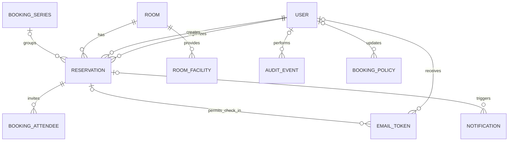

# Database design — first implementation module

The application uses PostgreSQL. Each meeting occurrence and room closure reserves time in the same `reservations` table, allowing one database constraint to reject overlapping occupied periods for a room. All displayed booking times use `Asia/Kathmandu`; timestamps are stored as timezone-aware instants. The first implementation module establishes this schema and tests its central constraints. Booking screens, email delivery, check-in jobs, and staff workflows are later modules.

## ERD

## Tables and keys

| Table | Key fields and relationships | Purpose |
| --- | --- | --- |
| `users` | `id` PK; `email` unique; `is_staff`, `is_active`; name and department | One identity per company address. Employee and staff are the two application permission levels. Named staff accounts support attribution. |
| `rooms` | `id` PK; unique `(location, floor, name)`; capacity, description, instructions, active flag | Five initial rooms, with later changes through staff controls. Inactive rooms cannot receive new bookings. |
| `room_facilities` | `id` PK; `room_id` FK; unique `(room_id, name)` | Room equipment and facilities. A simple room-specific list is sufficient for five rooms. |
| `booking_series` | `id` PK; `room_id`, `organizer_id`, `created_by_id` FKs; frequency, first/last dates | Groups the actual occurrences of a daily, weekly, or monthly request within the two-week advance window. It is not a promise to reserve later dates. |
| `reservations` | `id` PK; `room_id` FK; optional `series_id`, `organizer_id`, `created_by_id` FKs; kind, status, actual start/end, occupied start/end | Shared schedule for meetings and staff room closures. A meeting has organizer and title; a closure has a reason. Cancelled and no-show meetings remain in history but release occupancy. |
| `booking_attendees` | `id` PK; `reservation_id` FK; unique `(reservation_id, email)` | Email recipients and attendee count. Only meeting reservations may have attendees. |
| `email_tokens` | `id` PK; optional `user_id`, `reservation_id` FKs; token hash unique, purpose, expiry, consumed time | Short-lived employee login or per-occurrence check-in. Raw tokens are never stored. |
| `notifications` | `id` PK; optional `reservation_id` FK; recipient, event type, content snapshot, status, attempts, next attempt | Database outbox for email delivery and retries. A reservation change and its notifications commit together. |
| `audit_events` | `id` PK; optional `actor_id` FK; action, target, outcome, timestamp, safe details | Append-only application history, including system actions. No passwords, raw tokens, or SMTP secrets. |
| `booking_policy` | Singleton `id=1` PK; working hours, limits, slot size, gap, check-in deadline; optional `updated_by_id` FK | Configurable company-wide booking rules. Application logic validates rules on every write and records staff changes. |
| `company_holidays` | `id` PK; date unique, name | The official non-bookable working calendar, with staff exceptions recorded on affected reservations. |

There is no separate `roles` table because the confirmed application has exactly two permission levels: employee and staff. Django's `is_staff` flag identifies the shared Front Desk/Administrator level. Its built-in superuser flag is reserved for technical administration. A separate role catalog can be introduced if the business later requires distinct staff permissions.

## Reservation state and validation

`kind=booking` permits `confirmed`, `checked_in`, `completed`, `cancelled`, or `no_show`. `kind=block` permits `blocked` or `block_cancelled`. The database checks the kind/status pairing and requires the appropriate meeting or closure fields. Meeting start must precede end. The occupied interval must contain the meeting interval. For a normal meeting, `occupied_from = starts_at` and `occupied_until = ends_at + 15 minutes`; extra approved setup time may extend either end. A closure uses its own specified occupied interval. These relationships will be checked in both application logic and database constraints where feasible.

The first migration enables PostgreSQL's `btree_gist` extension. An exclusion constraint on `(room_id equality, tstzrange(occupied_from, occupied_until, '[)') overlap)` applies to active statuses. This rejects concurrent double booking and conflicts between a booking and a closure. Adjacent intervals may meet at the boundary, so a meeting ending at 11:00 blocks through 11:15 and the next meeting may start at 11:15. The application also locks the room row, checks availability, and writes in one transaction, making simultaneous requests for the same room wait their turn. The database constraint remains the final guard. All later edit, cancel, check-in, and no-show workflows must use the same transaction discipline. A conflict is shown to the user as an availability error.

Rules depending on the current policy, room activity, official holidays, staff overrides, allowed email domains, and attendee ownership cannot be fully expressed as simple row constraints. The application enforces them server-side. Staff activity and rule overrides are audited.

## Indexes and deletion

The exclusion constraint supplies the room/time search index. Add indexes for reservation start by room, upcoming reservations by organizer, due check-ins, pending notifications, and recent audit actions. Foreign keys prevent accidental deletion of a user or room referenced by booking history; deactivate instead. Booking history and audit records are retained for at least one year, with company policy defining any longer period.

## Migration and verification strategy

Numbered Django migrations are committed with the code and applied by a separate deployment step after a database backup. They are never generated on the production server. Schema changes must preserve existing history; destructive changes require a reviewed data migration and restore plan. Tests run against PostgreSQL, including overlap, adjacency, room closure conflict, cancellation release, and concurrent booking attempts. Email and authentication tests follow in their own modules.
