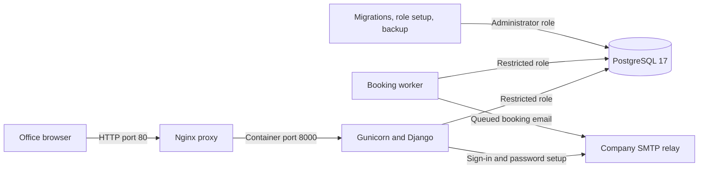

# MBS operations and maintenance runbook

**Transgate Tech | Binayak Bhandari**
**Applies to:** the `mbs-prod` application and the selected private-network HTTP installation.
**Reviewed:** 7 October 2026.

This handbook is for the person operating the Linux server. For screen-by-screen business work, read the [employee guide](user-guide.md) and [staff guide](staff-guide.md). For symptom-based diagnosis, use [troubleshooting](troubleshooting.md). The [HTTP deployment guide](deployment-http.md) covers the initial installation. The [HTTPS deployment guide](deployment.md) remains available for a future transport change.

## Contents

1. [Installation identity and architecture](#1-installation-identity-and-architecture)
2. [Open an operator terminal](#2-open-an-operator-terminal)
3. [Configuration reference and safe checks](#3-configuration-reference-and-safe-checks)
4. [Starting, stopping, restarting, and updating](#4-starting-stopping-restarting-and-updating)
5. [Staff access and password recovery](#5-staff-access-and-password-recovery)
6. [Service health, logs, and read-only database checks](#6-service-health-logs-and-read-only-database-checks)
7. [Worker and notification operations](#7-worker-and-notification-operations)
8. [Backups, scheduling, and monitoring](#8-backups-scheduling-and-monitoring)
9. [Restore drill into a separate database](#9-restore-drill-into-a-separate-database)
10. [Approved live recovery](#10-approved-live-recovery)
11. [Daily, weekly, and release checklists](#11-daily-weekly-and-release-checklists)
12. [Incident handover and operational limits](#12-incident-handover-and-operational-limits)
13. [Windows laptop differences](#13-windows-laptop-differences)

## 1. Installation identity and architecture

| Item | This office installation |
| --- | --- |
| Host OS | Oracle Linux 9.8, x86_64 |
| Repository | `https://github.com/BINAYAK016/MeetingRoomSystemWDN.git` |
| Deployment branch | `mbs-prod` |
| Server directory | `/opt/mbs/MeetingRoomSystemWDN` |
| Compose profile | `compose.prod.http.yaml` |
| Public origin | `http://mbs.wdn.com.np` |
| Office IPv4 / published listener | `192.168.50.222:80` |
| Approved employee domains | `wdn.com.np`, `transgate.com.np` |
| SMTP relay | `maildc01.wdn.com.np:25` |
| Approved sender | `mbs@wdn.com.np` |
| Selected mail security | No relay username/password; TLS and SSL false |
| App time zone | `Asia/Kathmandu`; database timestamps are timezone-aware |

The browser connects to Nginx on the office interface. Nginx forwards to Gunicorn/Django on container port 8000. Django and the background worker connect to PostgreSQL on container port 5432. Only the proxy publishes a host port; neither the web process nor PostgreSQL is directly published to the office network. HTTP uses no certificate mount, HTTPS redirect, HSTS, or Secure cookie flag. Browsers display **Not secure**. Keep this installation reachable through the approved office network/VPN.



### Services and responsibilities

| Service | Responsibility | Normal lifetime / health |
| --- | --- | --- |
| `proxy` | HTTP listener, reverse proxy, safe request timing/status logs | Continuous; probes web `/livez/` |
| `web` | Employee and staff screens, authentication, booking transactions, reports, static files | Continuous; probes `/healthz/` |
| `worker` | Pending-request expiry, no-show release, completion, reminder scheduling, notification delivery | Continuous; probes recent worker heartbeat |
| `db` | Durable data, constraints, sessions, audit, mail queue | Continuous; `pg_isready` |
| `migrate` | Applies committed Django migrations with database administrator rights | One-off command; tools profile |
| `db_setup` | Creates/updates application role and grants current-schema privileges | One-off command; tools profile |

Web and worker run as the image's non-root `appuser` (UID 1000), with read-only root filesystems, writable `/tmp`, dropped capabilities, and `no-new-privileges`. Static files are collected during the image build and served by WhiteNoise. Editing source on the server does not change an already-running image.

The production database network is internal. Web/worker also join the frontend network for SMTP access. Default frontend subnet `172.29.16.0/28` reserves `172.29.16.14` for the proxy outside the dynamic allocation range `172.29.16.0/29`. Only `172.29.16.14/32` is trusted for client-IP headers. Review all four network settings together if a company route overlaps this range.

### Database ownership

`POSTGRES_USER`/`POSTGRES_PASSWORD` are the PostgreSQL bootstrap administrator credentials. The migration, setup, backup, and restore tools use them. Web/worker receive `POSTGRES_APP_USER` and `POSTGRES_APP_PASSWORD` mapped to their connection variables instead.

The runtime role has login plus current-table SELECT/INSERT/UPDATE/DELETE and sequence USAGE/SELECT. It is `NOSUPERUSER`, `NOCREATEDB`, `NOCREATEROLE`, `NOINHERIT`. `db_setup` revokes UPDATE, DELETE, and TRUNCATE on `audit_events` from that role. Audit events remain insertable and readable. The administrator retains administrative power; this is not a cryptographic audit ledger.

Run `db_setup` after migrations and restores. It grants access to the current schema; it does not establish default privileges for future tables. PostgreSQL usernames/passwords in an initialized volume do not change merely because `.env` changes.

## 2. Open an operator terminal

The commands below are **Bash commands on the Linux server**, normally as the installation's existing root operator. Run this preamble in each new terminal:

```bash
cd /opt/mbs/MeetingRoomSystemWDN
mbs() { docker compose -f compose.prod.http.yaml "$@"; }
```

`mbs ps` is exactly `docker compose -f compose.prod.http.yaml ps`. The function exists only in the current shell. Commands involving `/etc`, `systemctl`, and backup scheduling require root privileges.

Confirm the installation before changing it:

```bash
pwd
git branch --show-current
git rev-parse --short HEAD
git status --short
docker --version
docker compose version
mbs ls
mbs ps -a
```

The expected branch is `mbs-prod`. Keep the same repository directory and Compose project identity. The existing default project is commonly `meetingroomsystemwdn`, but check `mbs ls` and container labels rather than assuming. A changed directory, `-p`, or `COMPOSE_PROJECT_NAME` can select a different project and therefore a different database volume. If a custom project name was used at installation, use that same name for every operation and backup; do not invent a new one for a routine restart.

Do not run local, production HTTP, and production HTTPS profiles against the same installation simultaneously. The production profiles use the same application image tag and service names.

## 3. Configuration reference and safe checks

### Current values and precedence

`.env` is read by Compose to interpolate its service configuration. It is not automatically sourced into Bash. Existing shell environment values can override interpolation from `.env`; use a clean operator shell if unexpected values persist. In particular, an exported `COMPOSE_PROJECT_NAME` can change the selected installation. See [Docker's environment-variable reference](https://docs.docker.com/compose/how-tos/environment-variables/envvars/).

Keep exactly one occurrence of every key. The earlier duplicate `DJANGO_PUBLIC_BASE_URL=https://...` and `DJANGO_HTTPS=true` lines must not remain in an HTTP installation. The production HTTP service definitions force `DJANGO_PRODUCTION=true` and `DJANGO_HTTPS=false`; the public URL must still be HTTP or the application fails its configuration checks. `DJANGO_ALLOWED_HOSTS` must be the single hostname used by this proxy, without a scheme, path, or wildcard.

| Variable | Meaning / selected value |
| --- | --- |
| `POSTGRES_DB` | Live database name; generated template uses `meeting_rooms` |
| `POSTGRES_USER` | Existing bootstrap administrator role; preserve for initialized volumes |
| `POSTGRES_PASSWORD` | Administrator secret; preserve actual database credential until deliberately rotated |
| `POSTGRES_APP_USER` | Distinct runtime role; template uses `meeting_rooms_app` |
| `POSTGRES_APP_PASSWORD` | Runtime secret; applied by `db_setup`, then consumed by recreated web/worker |
| `DJANGO_SECRET_KEY` | Independent generated secret, at least 50 characters in production; preserve across routine updates |
| `DJANGO_ALLOWED_HOSTS` | `mbs.wdn.com.np`; exact hostname |
| `DJANGO_PUBLIC_BASE_URL` | `http://mbs.wdn.com.np`; full origin, no trailing path/query/credentials |
| `DJANGO_PRODUCTION` | `true`; production safeguards are independent of transport |
| `DJANGO_HTTPS` | `false` in selected profile |
| `HTTP_BIND_IP` | `192.168.50.222`; explicit host interface address required |
| `EMPLOYEE_EMAIL_DOMAINS` | `wdn.com.np,transgate.com.np`; production Compose explicitly fixes these two domains |
| `DJANGO_EMAIL_BACKEND` | `smtp` for live login; `disabled` starts without mail; `file` is prohibited in production |
| `DJANGO_FROM_EMAIL` | `mbs@wdn.com.np`; approved sender |
| `SMTP_HOST` | `maildc01.wdn.com.np` |
| `SMTP_PORT` | `25`; valid range 1–65535 |
| `SMTP_USER` / `SMTP_PASSWORD` | Empty for this IP-authorized relay |
| `SMTP_USE_TLS` / `SMTP_USE_SSL` | Both `false` here; never enable both together |
| `PROXY_NETWORK_SUBNET` | `172.29.16.0/28` unless deliberately changed with IT |
| `PROXY_NETWORK_DYNAMIC_RANGE` | `172.29.16.0/29` |
| `PROXY_IP` | `172.29.16.14`; inside subnet, outside dynamic range |
| `AUTH_TRUSTED_PROXY_CIDRS` | `172.29.16.14/32`; trust the proxy only |

Production Compose sets `POSTGRES_HOST=db` and `POSTGRES_PORT=5432` internally; a host-shell `.env` override does not alter those service definitions. `DEBUG=False`, SMTP timeout 10 seconds, the 120-second worker health threshold, and authentication lifetimes are application constants, not supported `.env` tuning knobs. Adding `DEBUG=True` to `.env` will not enable Django debug mode.

Changing production employee domains requires a reviewed change to the production Compose definition as well as appropriate application configuration. Editing only `EMPLOYEE_EMAIL_DOMAINS` in `.env` changes the local profile, not this production profile.

The backup script accepts `COMPOSE_FILE`, `ENV_FILE`, `BACKUP_DIR`, and normal Compose project selection. It defaults to the HTTPS profile, so HTTP backups must explicitly set `COMPOSE_FILE=compose.prod.http.yaml`.

### Safe validation

```bash
chmod 600 .env
mbs config --quiet
```

No output from `config --quiet` means the Compose configuration resolved. It does not prove that the database credentials authenticate, mail reaches a mailbox, or DNS works.

Do not paste `.env`, plain expanded `docker compose config`, `docker inspect` environment arrays, passwords, sign-in links/codes, mail bodies, or database dumps into a support chat. To check duplicate keys without printing their values:

```bash
python3 - <<'PY'
from collections import Counter
from pathlib import Path
keys = []
for raw in Path('.env').read_text().splitlines():
    line = raw.strip()
    if line and not line.startswith('#') and '=' in line:
        keys.append(line.split('=', 1)[0].strip())
duplicates = sorted(key for key, count in Counter(keys).items() if count > 1)
print('Duplicate keys:', ', '.join(duplicates) if duplicates else 'none')
raise SystemExit(bool(duplicates))
PY
```

To print **effective nonsecret** Django settings from the running image:

```bash
mbs exec web python manage.py shell -c "from django.conf import settings; keys=('PRODUCTION_ENABLED','HTTPS_ENABLED','PUBLIC_BASE_URL','ALLOWED_HOSTS','EMPLOYEE_EMAIL_DOMAINS','MAIL_MODE','EMAIL_READY','SESSION_COOKIE_SECURE','CSRF_TRUSTED_ORIGINS','SECURE_REFERRER_POLICY'); print({k:getattr(settings,k,'MISSING') for k in keys})"
```

Expected transport values are production true, HTTPS false, HTTP public origin, session Secure false, trusted origin `http://mbs.wdn.com.np`, and referrer policy `same-origin`. CSRF tokens live in the server-side session; a separate `csrftoken` cookie is not expected.

### Credentials and rotation

The generator refuses to overwrite `.env`; use it only for a new installation:

```bash
python3 deploy/create-env.py --production --http
```

For an existing installation, edit the preserved file with `nano .env`. If a secret was disclosed, plan its rotation with IT. Rotating the runtime password requires applying it with `db_setup` and recreating web/worker; avoid a window in which old workers use the old password. Rotating the administrator password requires changing the actual PostgreSQL role and its stored configuration together. Do not assume an `up` command changes the role password. Changing the Django secret invalidates existing authentication signatures; arrange a sign-in interruption and request fresh links/codes afterward.

## 4. Starting, stopping, restarting, and updating

### Start in the background

Once schema and runtime grants already exist:

```bash
mbs up -d --wait --wait-timeout 180 db web worker proxy
mbs ps
curl --fail --show-error http://mbs.wdn.com.np/healthz/
```

`-d` runs detached. If you accidentally use attached `up`, use the displayed **d Detach** shortcut when available. Ctrl+C in an attached `up` stops its services; run the detached command again to start them.

### Stop while retaining all data

```bash
mbs stop proxy web worker
```

This stops the application and leaves PostgreSQL running for checks/backups. To stop PostgreSQL as well:

```bash
mbs stop db
```

To remove the selected project's containers/networks while retaining its named volumes:

```bash
mbs down
```

Do not add `--volumes` or use `docker volume rm`, `docker system prune --volumes`, or a global prune as a repair. They can delete the durable database or affect other applications.

### Restart versus recreate

| Situation | Operation |
| --- | --- |
| Same image/env; exited or stalled application process | Inspect logs first, then `mbs restart web worker` |
| `.env` changed | Recreate the affected services; `restart` retains old environment |
| Python, templates, CSS, or dependencies changed | Build a new image, then recreate web/worker |
| Nginx template changed | Recreate proxy; its startup renders the template |
| Database migration added | Stop writers, run `migrate`, then `db_setup`, before reopening |
| Docker daemon not running | Check `systemctl status docker`; start the host service through approved host operations |

After a mail/origin setting edit, with no schema change:

```bash
mbs config --quiet
mbs up -d --no-deps --force-recreate --wait --wait-timeout 180 web worker proxy
```

Do not use this shortcut for a runtime database password rotation: first stop web/worker, apply `db_setup` with the revised password, then recreate them. Existing authenticated sessions persist through ordinary process recreation because sessions are stored in PostgreSQL.

### Change a conflicting Docker subnet

This is a planned network change with an outage. Confirm the new subnet/range/proxy address with IT and identify all writers. Preserve the project name, `.env` credentials and named database volume. Take a backup first; stop if it fails.

```bash
COMPOSE_FILE=compose.prod.http.yaml sh deploy/backup.sh
mbs stop proxy web worker
mbs down
nano .env
```

Change `PROXY_NETWORK_SUBNET`, `PROXY_NETWORK_DYNAMIC_RANGE`, `PROXY_IP` and `AUTH_TRUSTED_PROXY_CIDRS` together. The proxy must be inside the subnet, outside the dynamic range; trust only its address. `down` removes the project's old containers/networks, retaining named volumes. Never add `--volumes`. Start with the same directory/project:

```bash
mbs config --quiet
mbs up -d --wait --wait-timeout 180 db web worker proxy
mbs ps
curl --fail --show-error http://mbs.wdn.com.np/healthz/
```

Verify employee access, effective trusted proxy configuration and SMTP reachability. A subnet change does not require new business records or a database reset.

### Full application update

Use a maintenance window. Stop if any command fails; do not continue startup after a failed migration or role setup.

```bash
git status --short
git rev-parse HEAD
COMPOSE_FILE=compose.prod.http.yaml sh deploy/backup.sh
mbs stop proxy web worker
git pull --ff-only
mbs build --pull
mbs run --rm migrate
mbs run --rm db_setup
mbs up -d --wait --wait-timeout 180 db web worker proxy
mbs ps
curl --fail --show-error http://mbs.wdn.com.np/healthz/
```

Record the previous commit, new commit, backup filename, migration results, and acceptance checks. `git pull --ff-only` deliberately stops if local commits/history conflict; review instead of forcing Git history. Preserve `.env`, secret storage, and the PostgreSQL volume.

Migrations must come from reviewed source control. Do not run `makemigrations` on production as a response to a missing table. Migrations use the administrator tool service, not the restricted web role. Migration 0008 preserves legacy confirmed meetings as approved; reversing it cancels pending/rejected records. A code rollback is not automatically a database rollback. Restore a tested compatible database and release together if rollback requires schema reversal.

For the CSRF/referrer fix, a code-only deployment after the documented release is sufficient: build web/worker, recreate them and proxy, then load a fresh form with Ctrl+F5. Do not disable CSRF or add `null` to trusted origins.

An orphan `mail_init` warning can come from the old local profile; it does not itself mean database failure. Inspect that container's labels and state before removing a named obsolete container. Do not apply a broad orphan-cleanup flag without verifying which project services it affects.

## 5. Staff access and password recovery

The supported staff UI is **Staff desk**, `/staff/`, not an exposed Django `/admin/` site. Front Desk and Administrators have identical permissions. Employee email-link authentication does not complete staff authentication, even for a user marked staff.

### Initial setup from the server

The command below changes access and **sends a password setup email**. Use only for approved staff addresses:

```bash
# Examples only: substitute the actual individually approved staff addresses.
mbs exec web python manage.py create_staff_account person@wdn.com.np
mbs exec web python manage.py create_staff_account colleague@transgate.com.np
```

The command normalizes address case, creates or reuses the account, makes it active/staff, records `staff_bootstrap`, and sends a one-time password setup/reset link. It can therefore reactivate an existing inactive account; do not run it for a departed user. Re-running does not create a duplicate account. It does not replace the password until the recipient completes setup.

`Staff enabled, but setup email failed: ...` means access was granted but delivery failed. Repair mail, then rerun for the same approved user or use the existing staff UI's **Email setup link** action. Relay acceptance is not proof of mailbox arrival.

### Normal staff sign-in

1. Open `http://mbs.wdn.com.np/staff/sign-in/`.
2. Enter company email and password.
3. Enter the newest eight-digit code from the company mailbox in the same browser session.
4. Staff verification lasts eight hours. A fresh login requires password and email code again.

Password setup links last one hour. The setup screen requires matching passwords of at least 12 characters and Django password validation. Codes last 10 minutes and allow at most five attempts. Starting another successful password challenge invalidates the previous unused challenge; use the newest email. Password attempts are throttled (five per account and 30 per observed client IP per 15-minute window). Do not erase throttle rows to bypass the protection.

### Staff UI access management

Open **Staff desk → People** (`/staff/users/`). Search for the address, edit names/department, enable/disable active status, and grant/revoke Front Desk/Administrator access. Save changes. Use **Email setup link** for an approved active staff user's forgotten password.

Access changes invalidate sessions and pending sign-in challenges. The UI prevents a staff member from removing their own staff access. User/booking history is retained; deactivation does not cancel their existing meetings. Review affected meetings separately through the supported booking screens. Password setup/reset also revokes staff challenges and changes the session authentication version.

If all staff are locked out, an authorized server operator can bootstrap a designated approved staff address using the command above. Do not edit users/password hashes directly in SQL or enable a separate password-only admin bypass.

## 6. Service health, logs, and read-only database checks

### Health meaning

| Check | Healthy result | What it proves |
| --- | --- | --- |
| `/livez/` | HTTP 200, `ok` | Web process can return a simple response |
| `/healthz/` | HTTP 200, JSON `status/database/worker = ok` | PostgreSQL query works and worker success heartbeat is within 120 seconds |
| `check_worker_health` | `ok`, exit 0 | A recent successful reconciliation exists |
| DB health | Healthy from `pg_isready` | Server is accepting connections; not a full schema or role-permission check |

Readiness `email=configured` means settings supply the relay host/sender. It does **not** connect to SMTP or prove delivery. Readiness can be healthy with `email=unavailable` if mail is intentionally disabled. Proxy health uses liveness, so a green proxy alone does not prove the database/worker are healthy. Docker restart policies restart exited processes; an unhealthy-but-running process needs alerting and diagnosis.

```bash
mbs ps -a
mbs exec web python manage.py check
mbs exec worker python manage.py check_worker_health
curl --fail --show-error http://mbs.wdn.com.np/livez/
curl --fail --show-error http://mbs.wdn.com.np/healthz/
curl --fail --show-error -H 'Host: mbs.wdn.com.np' http://192.168.50.222/healthz/
```

The IP/Host-header check distinguishes DNS problems from application availability. It does not repair employee DNS resolution or email links. Check office-facing resolution and listeners:

```bash
getent hosts mbs.wdn.com.np
ip -brief address
ss -ltnp 'sport = :80'
df -h
df -i
free -h
docker stats --no-stream
```

### Logs

```bash
mbs logs --since 15m --tail 200 web worker proxy db
mbs logs --follow --since 2m --tail 50 web worker proxy
```

Ctrl+C stops log following; it does not stop the containers when using `logs --follow`. Narrow the period around the reported incident, then expand only if necessary. Root's host-level diagnostics are:

```bash
systemctl status docker --no-pager
journalctl -u docker --since '30 minutes ago' --no-pager
journalctl -k --since '30 minutes ago' --no-pager
getenforce
```

Keep SELinux enabled. Inspect relevant denial records/labels through IT's troubleshooting process; do not disable SELinux or firewalld as a blanket fix.

Application logs record exception type, source locations and, where available, SQLSTATE; they avoid exception values, request payloads, passwords, and token URLs. CSRF rejections record a safe category and request reference. Nginx logs time, method, status, byte count, duration, upstream status, and request ID without URI/query values. Token-bearing sign-in/check-in/password-setup routes deliberately suppress Nginx access logs. Absence of a token URL in proxy logs is expected.

A worker can be healthy and quiet: it prints `released=... completed=... reminders=... sent=...` only when there is activity. `released` counts no-show releases; pending-request expiry also runs but is not included in that counter. Use database status and audit events to investigate pending expiry.

Store incident excerpts privately:

```bash
umask 077
MBS_INCIDENT_DIR="/var/log/mbs-incident-$(date -u +%Y%m%dT%H%M%SZ)"
mkdir -m 700 "$MBS_INCIDENT_DIR"
mbs logs --no-color --since 30m --tail 500 web worker proxy db > "$MBS_INCIDENT_DIR/containers.log" 2>&1
mbs ps -a > "$MBS_INCIDENT_DIR/services.txt"
git rev-parse HEAD > "$MBS_INCIDENT_DIR/revision.txt"
```

Review any host/third-party log excerpt before sharing; PostgreSQL/admin or operating-system messages can contain more detail than the application's sanitized logs. Do not use `set -x` during credential-bearing operations.

### Committed migrations

These checks do not apply schema changes:

```bash
mbs exec web python manage.py showmigrations booking
mbs exec web python manage.py migrate --plan
```

All committed booking migrations, including 0008, should be marked applied on a deployed current release. If changes are needed, follow the maintenance workflow using `mbs run --rm migrate` and `mbs run --rm db_setup`.

### Runtime identity and privileges

This prints only role capabilities and a few privileges, not passwords:

```bash
mbs exec web python manage.py shell -c "from django.db import connection; c=connection.cursor(); c.execute('SELECT current_database(), current_user'); print('runtime:', c.fetchone()); c.execute('SELECT rolname, rolsuper, rolcreatedb, rolcreaterole, rolinherit FROM pg_roles WHERE rolname=current_user'); print('role:', c.fetchone()); c.execute(\"SELECT has_table_privilege(current_user,'public.reservations','SELECT'), has_table_privilege(current_user,'public.reservations','INSERT'), has_table_privilege(current_user,'public.audit_events','INSERT'), has_table_privilege(current_user,'public.audit_events','UPDATE'), has_table_privilege(current_user,'public.audit_events','DELETE')\"); print('reservation SELECT/INSERT, audit INSERT/UPDATE/DELETE:', c.fetchone())"
```

Expected runtime identity is the configured application role; all four role capability flags should be false. Expected privilege tuple is `(True, True, True, False, False)`. If schema permissions are missing after migration, inspect the successful migration/setup results and rerun the supported `db_setup` during maintenance.

### Read-only database operational snapshot

The following uses database administrator access **only for SELECT diagnostics**, establishes a read-only transaction, and does not print meeting descriptions, email-token hashes, notification bodies, or passwords:

```bash
mbs exec -T db sh -c 'PGPASSWORD="$POSTGRES_PASSWORD" psql --no-psqlrc -v ON_ERROR_STOP=1 -U "$POSTGRES_USER" -d "$POSTGRES_DB"' <<'SQL'
BEGIN READ ONLY;
SELECT current_database() AS database, current_user AS operator_role, now() AS server_time;
SELECT id, last_success_at, last_error_at,
       round(extract(epoch FROM now() - last_success_at)) AS success_age_seconds
FROM worker_heartbeat;
SELECT status, COUNT(*) AS jobs, MIN(next_attempt_at) AS earliest_next_attempt
FROM notifications GROUP BY status ORDER BY status;
SELECT id, event_type, status, attempts, next_attempt_at, lease_expires_at, last_error
FROM notifications
WHERE status IN ('failed','sending')
ORDER BY next_attempt_at, id LIMIT 30;
SELECT status, COUNT(*) AS bookings
FROM reservations WHERE kind='booking' GROUP BY status ORDER BY status;
SELECT COUNT(*) AS active_rooms FROM rooms WHERE is_active;
SELECT COUNT(*) AS active_staff FROM users WHERE is_active AND is_staff;
SELECT opens_at, closes_at, minimum_minutes, maximum_minutes, slot_minutes,
       gap_minutes, advance_days, check_in_minutes FROM booking_policy WHERE id=1;
SELECT action, outcome, COUNT(*) AS recent_events
FROM audit_events WHERE created_at >= now() - interval '24 hours'
GROUP BY action, outcome ORDER BY action, outcome;
COMMIT;
SQL
```

`last_error_at` is the most recent failed cycle timestamp; a later successful cycle can mean the incident recovered. Notification `last_error` holds the exception class, not the SMTP response/body. Look at the matching safe worker logs and ask IT for relay diagnostics when a policy rejection needs its exact server-side reason.

Do not repair business state with SQL UPDATE/DELETE statements. Approval, cancellation, access changes, room changes, and retry decisions have invariants and audit behavior; use the supported UI/services/management commands.

## 7. Worker and notification operations

### Timing and state

The worker loop runs about once per second, closes stale DB connections, and reconciles scheduling approximately every 30 seconds. A reconciliation:

- Cancels requests still pending at or after meeting start, with reason `Approval window expired before the meeting started`.
- Changes approved meetings whose check-in deadline passed to **No show**, releases their occupied slot, and records the cancellation reason.
- Marks checked-in meetings completed after their end.
- Queues one-hour reminders for eligible approved upcoming bookings.
- Updates singleton heartbeat `worker_heartbeat.id=1`.

Then it attempts at most one queued message per loop, with SMTP timeout 10 seconds. A slow send can delay the next reconciliation by up to a timeout; deadlines are enforced again by the check-in action, so stale processing does not extend the valid check-in window. Batch limits mean a large overdue backlog can take several reconciliation cycles.

Notification states are `pending`, `sending`, `sent`, `failed`, and `skipped` (superseded). Sending uses an exclusive row claim plus a five-minute lease. The lease supports recovery after a worker interruption. Each send increments attempts; maximum is five. After failures on attempts one through four, automatic retries wait 2, 4, 8, and 16 minutes. A failure on attempt five is terminal for automatic delivery and remains for operator review; its recorded next-attempt timestamp is 32 minutes later, but there is no automatic sixth send. There is no guarantee of exactly-once delivery if a process dies after the relay accepts mail but before the DB records success.

For queued booking mail, `reservation_revision` and current booking state prevent stale reminders/confirmations from being sent after edits/cancellation. `skipped` is usually deliberate supersession, not a mail outage. A reminder includes the organizer's check-in link only for the organizer; attendees receive meeting timing and are told the organizer handles check-in.

Employee login links, staff codes, and password setup messages are sent synchronously, outside the booking notification queue. Retrying queued booking mail does not recreate an expired login challenge. Request a fresh login/setup message through its supported flow after fixing SMTP.

### Disabled mail

`DJANGO_EMAIL_BACKEND=disabled`, or SMTP mode missing a relay host/sender, leaves delivery unavailable. The worker still reconciles booking lifecycle/heartbeat; pending booking notifications are not consumed by the disabled backend. Employee/staff email sign-in cannot succeed, and staff setup mail fails. Do not switch to production file mail or treat a healthy heartbeat as mail verification.

### Send an intentional relay test

The following **sends one real test email** to an authorized recipient entered at the prompt. Use when verifying a planned mail repair:

```bash
mbs exec web python manage.py shell -c "from booking.services.mail_delivery import deliver_mail; recipient=input('Authorized test recipient: ').strip(); print('Accepted by relay:', deliver_mail('MBS operations test', 'Test message from the MBS server.', [recipient]))"
```

Expected output is `Accepted by relay: 1`. Confirm mailbox arrival, sender identity, and any quarantine/spam routing with IT. The new server must be allowed by the relay based on its actual SMTP source IP; its HTTP listener address is not necessarily the relay-visible source in a routed/NAT network.

### Retry eligible failed booking mail

First correct mail settings, recreate web/worker if settings changed, and verify delivery. Inspect failed IDs with the read-only snapshot. To retry one identified failed notification:

```bash
mbs exec web python manage.py retry_failed_mail --id 123
```

Replace `123` with the actual numeric notification ID. To review all failed jobs after a general mail outage:

```bash
mbs exec web python manage.py retry_failed_mail --all
```

One of `--id` or `--all` is required. The command checks booking status, revision, and useful lifetime; eligible jobs become pending with attempts reset, obsolete jobs become skipped, and audit events are appended. Output is `requeued=N superseded=N`. It does not instantly deliver mail; the normal worker sends the requeued jobs. Do not repeatedly requeue while the relay remains broken.

Avoid running an extra `run_booking_worker --once` as a read-only test. It can send real mail, expire requests/no-shows, and complete bookings. Normal health checks use `check_worker_health` and do not execute business jobs.

## 8. Backups, scheduling, and monitoring

### What is backed up

`deploy/backup.sh` dumps the selected database in PostgreSQL custom format, verifies `pg_restore --list`, and writes a private file under `deploy/backups/`. It uses a unique `.partial` file, removes it if the operation fails, sets directory mode 700/file mode 600, then atomically renames a verified archive to `.dump`. Database dumps contain company data and authentication/session records; protect them like production data.

A database dump does not include PostgreSQL cluster roles/passwords, `.env`, Git source, Docker images, host DNS/firewall settings, or future certificate files. Keep `.env` separately in company-approved secret storage; keep release commit identifiers and installation instructions with recovery records. Store original administrator credentials for an existing volume and current runtime credentials for role recreation. `db_setup` can recreate the application role in a recovered cluster.

### Create and verify a backup

```bash
COMPOSE_FILE=compose.prod.http.yaml sh deploy/backup.sh
ls -lh deploy/backups/*.dump
```

Record the exact `Backup written:` filename. Choose that file explicitly; do not automatically restore whichever filename sorts last. Example selection below must be changed to the real existing filename:

```bash
MBS_BACKUP='/opt/mbs/MeetingRoomSystemWDN/deploy/backups/REPLACE_WITH_ACTUAL_FILENAME.dump'
test -f "$MBS_BACKUP"
test -s "$MBS_BACKUP"
mbs exec -T db pg_restore --list < "$MBS_BACKUP" > /dev/null
sha256sum "$MBS_BACKUP"
```

Stop if any check fails. Archive-list success is structural validation, not proof that the archive restores. Perform the separate-database drill below.

`pg_dump` obtains a consistent database snapshot while normal transactions continue. Live record counts taken afterward can legitimately differ from its snapshot. For an exact count comparison, use a maintenance window with web/worker stopped and capture counts alongside that backup. Account for externally connected approved administrative tools as writers too.

### Copy and retention

Copy the verified dump and checksum to company-approved **separate** storage using its approved encrypted transfer method. Do not place passwords in an `scp` command. A template for an already configured SSH destination is:

```bash
scp "$MBS_BACKUP" APPROVED_BACKUP_USER@APPROVED_BACKUP_HOST:/APPROVED_PRIVATE_MBS_DIRECTORY/
```

Replace all destination placeholders with IT's real approved target; verify the destination host key through IT. Verify checksum and restore readability on the stored copy. Local-only backups do not survive loss of this server/volume. Ensure the backup destination and secret storage have separate access controls.

IT should record a retention schedule, storage owner, off-host transfer method, and recovery targets. An example for a small office is seven daily, four weekly, and twelve monthly verified backups; confirm the actual policy rather than enforcing a sample by deleting files. Booking/audit history needs at least the agreed one-year business retention. The app implements no automatic history purge.

To preview old local dumps without deleting anything:

```bash
find /opt/mbs/MeetingRoomSystemWDN/deploy/backups -maxdepth 1 -type f -name 'meeting_rooms_*.dump' -mtime +30 -print
```

Delete only explicitly reviewed files after confirming off-host retention and a tested restore, using your approved retention process. Avoid wildcards or recursive deletion as incident cleanup.

### Schedule one daily backup on Oracle Linux

This example schedules 02:00 in the **server's configured local time zone**, not automatically Nepal time. Check the time zone and choose a company-approved slot. Oracle documents cron scheduling in its [Oracle Linux 9 task automation guide](https://docs.oracle.com/en/operating-systems/oracle-linux/9/cron/index.html).

```bash
timedatectl
dnf install -y cronie
systemctl enable --now crond
install -d -m 700 /var/log/mbs
```

Create a wrapper outside the Git checkout. This changes only backup scheduling when the operator executes it:

```bash
cat > /usr/local/sbin/mbs-backup <<'SH'
#!/bin/sh
set -eu
umask 077
cd /opt/mbs/MeetingRoomSystemWDN
printf 'Backup started: %s\n' "$(date -u +%Y-%m-%dT%H:%M:%SZ)"
COMPOSE_FILE=compose.prod.http.yaml sh deploy/backup.sh
date -u +%Y-%m-%dT%H:%M:%SZ > /var/log/mbs/backup-last-success
printf 'Backup completed: %s\n' "$(date -u +%Y-%m-%dT%H:%M:%SZ)"
SH
chmod 700 /usr/local/sbin/mbs-backup
```

For an installation with a custom Compose project name, add its **actual existing** `COMPOSE_PROJECT_NAME` to the wrapper's backup invocation. The default checkout uses its directory-derived project name; leave it unchanged otherwise.

Run and verify the wrapper once before scheduling:

```bash
/usr/local/sbin/mbs-backup
cat /var/log/mbs/backup-last-success
```

Create the cron entry; `flock` prevents overlapping scheduled runs:

```bash
cat > /etc/cron.d/mbs-backup <<'CRON'
SHELL=/bin/sh
PATH=/usr/local/sbin:/usr/local/bin:/usr/sbin:/usr/bin:/sbin:/bin
0 2 * * * root /usr/bin/flock -n /run/lock/mbs-backup.lock /usr/local/sbin/mbs-backup >> /var/log/mbs/backup.log 2>&1
CRON
chmod 644 /etc/cron.d/mbs-backup
```

No notification delivery is built into this cron example. IT monitoring must alert on a stale/missing success marker or failed job; logs alone do not notify an operator. Add approved off-host copy/verification separately; a local backup success marker does not prove off-host transfer.

Configure rotation for this operator log if `logrotate` is installed:

```bash
cat > /etc/logrotate.d/mbs-backup <<'ROTATE'
/var/log/mbs/backup.log {
    daily
    rotate 14
    compress
    missingok
    notifempty
    create 0600 root root
}
ROTATE
```

Check schedule and latest success:

```bash
systemctl status crond --no-pager
cat /etc/cron.d/mbs-backup
tail -n 40 /var/log/mbs/backup.log
python3 - <<'PY'
from pathlib import Path
import time
marker = Path('/var/log/mbs/backup-last-success')
if not marker.exists():
    raise SystemExit('ALERT: no successful scheduled backup marker')
age = time.time() - marker.stat().st_mtime
print('Hours since latest local backup success:', round(age / 3600, 2))
raise SystemExit(1 if age > 26 * 3600 else 0)
PY
```

Docker logs also need bounded host retention under IT's logging policy; this repository does not configure a rotating Docker log driver. `docker system df` is safe to inspect space, but do not run a global prune to solve growth.

## 9. Restore drill into a separate database

This drill **creates a new database and restores business data there**. It does not restore over or delete the live database. It shares the same PostgreSQL server/storage, so schedule it when extra disk/CPU usage is acceptable; a separate recovery host is stronger isolation for a full disaster rehearsal. Do not launch a worker against the drill database: it could send duplicate real company mail or alter restored booking states.

Only restore trusted company-created backups. PostgreSQL custom archives contain executable schema definitions. The flags below fail on restore errors and intentionally skip original ownership/ACLs, so the restoring administrator owns objects and `db_setup` reapplies application permissions. See [PostgreSQL 17 pg_restore](https://www.postgresql.org/docs/17/app-pgrestore.html).

### 9.1 Choose and validate the archive and target

Run after selecting the actual `MBS_BACKUP` in section 8:

```bash
test -f "$MBS_BACKUP"
test -s "$MBS_BACKUP"
mbs exec -T db pg_restore --list < "$MBS_BACKUP" > /dev/null
MBS_RESTORE_DB="mbs_restore_$(date -u +%Y%m%d_%H%M%S)"
case "$MBS_RESTORE_DB" in
    mbs_restore_[0-9]*) ;;
    *) printf '%s\n' 'Invalid restore target'; exit 1 ;;
esac
printf 'Separate restore database: %s\n' "$MBS_RESTORE_DB"
```

Validate that it differs from the live database before creation:

```bash
mbs exec -T -e MBS_RESTORE_DB="$MBS_RESTORE_DB" db sh -c '
set -eu
test "$MBS_RESTORE_DB" != "$POSTGRES_DB"
case "$MBS_RESTORE_DB" in
    mbs_restore_*) ;;
    *) exit 1 ;;
esac
export PGPASSWORD="$POSTGRES_PASSWORD"
createdb -U "$POSTGRES_USER" --maintenance-db="$POSTGRES_DB" "$MBS_RESTORE_DB"
'
```

`createdb` fails if that name already exists; do not reuse, clean, or drop it automatically. Choose a new unique target and understand why the first creation failed. Continue only if creation succeeded.

### 9.2 Restore into the empty target

```bash
mbs exec -T -e MBS_RESTORE_DB="$MBS_RESTORE_DB" db sh -c '
set -eu
test "$MBS_RESTORE_DB" != "$POSTGRES_DB"
export PGPASSWORD="$POSTGRES_PASSWORD"
pg_restore -U "$POSTGRES_USER" -d "$MBS_RESTORE_DB" --exit-on-error --single-transaction --no-owner --no-privileges
' < "$MBS_BACKUP"
```

Do not add `--create`, `--clean`, or `--disable-triggers`. `--create` can restore to the database name embedded in an archive instead of the intended target. This procedure selects the target explicitly.

### 9.3 Inspect restored schema, constraints, and counts

```bash
mbs exec -T -e MBS_RESTORE_DB="$MBS_RESTORE_DB" db sh -c 'PGPASSWORD="$POSTGRES_PASSWORD" psql --no-psqlrc -v ON_ERROR_STOP=1 -U "$POSTGRES_USER" -d "$MBS_RESTORE_DB"' <<'SQL'
BEGIN READ ONLY;
SELECT current_database() AS restored_database;
SELECT 'users' AS table_name, COUNT(*) AS rows FROM users
UNION ALL SELECT 'rooms', COUNT(*) FROM rooms
UNION ALL SELECT 'reservations', COUNT(*) FROM reservations
UNION ALL SELECT 'booking_series', COUNT(*) FROM booking_series
UNION ALL SELECT 'booking_attendees', COUNT(*) FROM booking_attendees
UNION ALL SELECT 'notifications', COUNT(*) FROM notifications
UNION ALL SELECT 'audit_events', COUNT(*) FROM audit_events;
SELECT name FROM django_migrations WHERE app='booking' ORDER BY name;
SELECT extname FROM pg_extension WHERE extname='btree_gist';
SELECT conname, contype, convalidated FROM pg_constraint
WHERE conrelid='public.reservations'::regclass ORDER BY conname;
SELECT status, COUNT(*) FROM reservations GROUP BY status ORDER BY status;
COMMIT;
SQL
```

Confirm the expected snapshot's migration list, row counts, known rooms/bookings, audit history, and overlap exclusion constraint `reservation_room_occupied_no_overlap`. Compare exact counts with a same-snapshot/writer-stopped manifest if one was recorded; do not demand equality with a still-changing live database.

### 9.4 Reapply grants and verify the restricted role

This affects privileges on the separate drill database, leaving `.env` and live database selection unchanged:

```bash
mbs run --rm -e POSTGRES_DB="$MBS_RESTORE_DB" db_setup
mbs run --rm --no-deps -e POSTGRES_DB="$MBS_RESTORE_DB" web python manage.py shell -c "from django.db import connection; from booking.models import Room,Reservation,AuditEvent; c=connection.cursor(); c.execute('SET default_transaction_read_only=on'); c.execute('SELECT current_database(), current_user'); print(c.fetchone()); print('rooms/reservations/audit:', Room.objects.count(), Reservation.objects.count(), AuditEvent.objects.count()); c.execute(\"SELECT has_table_privilege(current_user,'public.audit_events','INSERT'), has_table_privilege(current_user,'public.audit_events','UPDATE'), has_table_privilege(current_user,'public.audit_events','DELETE')\"); print('audit INSERT/UPDATE/DELETE:', c.fetchone())"
```

The query must report the drill database plus application role, readable records, and audit privileges `(True, False, False)`. `db_setup` also sets the configured application-role password at cluster level; use the unchanged current `.env` credentials so live web/worker credentials remain consistent.

Record archive checksum, release commit, restored target, counts, constraint/role results, duration, date, and reviewer. Leave the drill database untouched until IT approves its cleanup and verifies the target name is the drill database, not production. No automatic deletion command is included here.

## 10. Approved live recovery

This is **a maintenance action that changes the live database selected by the application**. Use only after IT approves a specific recovery point and accepts loss of transactions after that backup. It is not a troubleshooting shortcut. Review release/schema compatibility and identify all writers before executing it.

The safer procedure restores into a new database and switches the application to it; it retains the original live database for investigation. It does not overwrite/drop the original or erase the PostgreSQL volume.

1. Record the failure time, current release, current database name, approved archive/checksum, last known good backup, and approved recovery target. Check the destination host/project/directory. Inform users of maintenance.
2. Stop browser access and every writer. Keep PostgreSQL running:

```bash
mbs stop proxy web worker
mbs ps -a
```

3. Take a **pre-recovery** backup of the original database if PostgreSQL is accessible, and copy it off-host. If it cannot be backed up, record the failure and preserve the existing volume rather than deleting it:

```bash
COMPOSE_FILE=compose.prod.http.yaml sh deploy/backup.sh
```

4. Follow section 9 with the explicitly approved archive to create a **new empty recovery database**, restore, verify counts/schema/constraints, and verify runtime permissions. Do not start the restored worker during verification. Make sure the target is different from the original live name and no other service currently uses it.
5. Back up the current `.env` privately before switching its database name. This file contains secrets; keep it out of Git and support messages:

```bash
umask 077
MBS_ENV_RECOVERY_COPY="/root/mbs-env-before-recovery-$(date -u +%Y%m%dT%H%M%SZ)"
install -m 600 .env "$MBS_ENV_RECOVERY_COPY"
nano .env
```

Set **only** `POSTGRES_DB` to the verified recovery database's exact name. Preserve administrator/runtime usernames/passwords, Django secret, selected HTTP settings, and mail settings. Remove duplicates. Do not change the database role credentials as part of a restore unless the reviewed recovery plan requires it.

6. Validate/recreate DB service configuration against the same existing named volume, then run the compatible release's committed migrations and grants with writers still stopped:

```bash
mbs config --quiet
mbs up -d --wait --wait-timeout 180 db
mbs run --rm migrate
mbs run --rm db_setup
```

The official PostgreSQL image skips initialization on an existing volume; this does not create the selected recovery database. It must already exist from the completed restore. Stop if any command fails.

7. Before workers resume, review how old state affects queued notifications, future bookings, and access. A recovered queue can contain mail that was already accepted after the backup and might resend. An old heartbeat is expected. Once staff approves resume, start the application:

```bash
mbs up -d --wait --wait-timeout 180 web worker proxy
mbs ps
curl --fail --show-error http://mbs.wdn.com.np/healthz/
```

8. Verify runtime database identity with section 6, staff/employee login, room/booking history, future pending/approved requests, queues, check-in handling, reports, and audit. Request fresh login links/codes rather than reusing restored old messages. Inform users of the actual recovery point and reconcile meetings/actions performed after that point.

9. Update backup monitoring for the new selected database; create/copy a fresh backup. Keep the original database and pre-recovery backup through IT's approved investigation/retention period.

If rollback is needed, stop every writer again and review which database has accepted new transactions. Switching back after recovered writes can lose those writes; do not casually alternate database names or attempt to merge rows directly. Use an explicit reviewed recovery/reconciliation plan.

## 11. Daily, weekly, and release checklists

### Daily operator checks

- `mbs ps`: db/web/worker/proxy running and healthy.
- `/healthz/`: DB/worker healthy; note whether email is configured.
- Read-only notification snapshot: failed jobs, exhausted attempts, overdue sending leases, oldest pending work.
- Staff desk: pending requests reviewed before their starts; operational no-shows understood.
- Latest scheduled backup marker, successful off-host transfer, free disk/inodes.
- Review recent worker/DB error counts; do not treat every superseded notification as an outage.

### Weekly checks

- Verify one stored off-host archive/checksum and retention inventory.
- Review staff access, departed employees, SMTP relay permission, and active room inventory with owners.
- Inspect Docker log/dump/storage growth and backup scheduler failures.
- Confirm server clock/time synchronization and office DNS resolution from a real employee device.
- Review audit events for denied authentication, access changes, overrides, retry operations, and booking decisions.
- Confirm room closures/holidays/policy are current; do not silently rewrite historic reservations.

### Monthly / after infrastructure changes

- Perform and document a separate-database restore drill; periodically rehearse on a separate host too.
- Review approved backup recovery point/objectives and measured restore duration.
- Test employee email-link login, staff password/code login, confirmation/reminder delivery, and email check-in on representative company devices/mailboxes.
- Recheck firewall/VPN scope, SELinux, and relay source-IP authorization after network changes.

### Release acceptance

- Record approved release commit; check clean checkout and compatible schema.
- Verified backup exists off-host; recovery plan prepared before migration.
- Stop all writers for migrations, apply committed migrations, rerun runtime grants.
- All health checks return expected status; inspect safe startup/error logs.
- Employee can request/confirm a login; staff can authenticate with password/code.
- Room search/details/calendar work; staff can edit rooms under Staff desk → Rooms.
- Submit one approved test workflow: pending hold → approval/rejection, edit approval behavior, cancellation, recurring occurrence horizon, valid check-in/no-show handling.
- Confirm reports/audit/access controls and actual mailbox delivery; do not infer all this from HTTP 200 alone.
- Keep test meetings distinguishable and cancel eligible test bookings through the UI after verification.

## 12. Incident handover and operational limits

### Send IT enough evidence

Provide the incident time/time zone, affected ordinary URL path or named screen, user role, exact visible error, whether fresh/incognito browser reproduces, release commit, `mbs ps`, health results, effective nonsecret settings, and relevant sanitized logs/request IDs. Include SMTP host/port/from address and the relay-visible server source IP when mail is involved. Do not provide raw sign-in/check-in/password-reset links, codes, passwords, full `.env`, notification bodies, or dumps.

Identify whether the failure is:

- **Client/DNS/network:** cannot resolve/reach office HTTP address; IP/Host-header server test works.
- **Proxy/web:** liveness fails, proxy returns 502/504, web exits/unhealthy.
- **Database:** readiness reports unavailable DB, role authentication/permission/schema errors.
- **Worker:** DB is okay but success heartbeat missing/stale; lifecycle jobs/notifications stop advancing.
- **SMTP:** app is healthy but sign-in/setup fails or queued sends accumulate.
- **Business rule:** request denied by overlap, policy, horizon, inactive room, authorization, or expired check-in; use staff workflows rather than infrastructure restarts.

### Known boundaries

- This is a single-server application; Docker restart policies and backups are not high availability.
- A healthy site does not prove SMTP delivery, office DNS/firewall, backup copy, or restore readiness.
- Calendar is built into the app; direct HCL/Outlook integration is deferred.
- Recurrence creates explicit occurrences only within the permitted horizon (default 14 days). It does not reserve future months automatically; organizers book later eligible months manually.
- Front Desk/Administrators share powers; WDN third-floor senior-management priority is handled manually.
- Worker recovery after an outage can expire already-started pending requests and mark overdue approved meetings no-show. Staff manual check-in also obeys the valid window; it cannot retroactively bypass the deadline.
- Policy, holiday, room deactivation, and account deactivation changes do not automatically rewrite/cancel all existing bookings. Staff reviews affected future meetings.
- Reports use current policy/holidays for utilization and are operational estimates, not a historically reconstructed accounting system.
- There is no built-in alerting, automatic off-host backup copy, automatic data purge, or exactly-once SMTP guarantee.
- The HTTP production profile intentionally generates transport warnings in Django `check --deploy`; do not disable CSRF/auth safeguards to silence them.

## 13. Windows laptop differences

Laptop development uses **`compose.yaml`**, loopback **`http://127.0.0.1:8000`**, a file-email development inbox, and the administrator DB role. It is separate from the company production profile. Start Docker Desktop with its Linux engine first. An `npipe/dockerDesktopLinuxEngine` connection failure means the Docker engine is not available; no migration has run successfully through that failure.

In **PowerShell**, from your actual local checkout:

```powershell
Set-Location 'C:\Users\Dell\Documents\Codex\2026-09-28\files-mentioned-by-the-user-meeting\outputs\meeting-room-booking'
docker info --format '{{.ServerVersion}}'
docker compose -f compose.yaml config --quiet
docker compose -f compose.yaml up -d db
docker compose -f compose.yaml run --rm migrate
docker compose -f compose.yaml up -d web worker
docker compose -f compose.yaml ps
docker compose -f compose.yaml logs --since 10m --tail 100 web worker db
```

For a fresh local `.env`, the generator without production flags selects `.env.example`; use your installed Python 3.12 command:

```powershell
python deploy/create-env.py
```

It refuses to overwrite an existing file. Keep local `DJANGO_PRODUCTION=false`, `DJANGO_HTTPS=false`, `DJANGO_PUBLIC_BASE_URL=http://127.0.0.1:8000`, and suitable localhost/127.0.0.1 hosts. Production settings copied into the local profile can disable the demo inbox or make generated URLs point at the office server. Use the same loopback address consistently across form and email link.

Local file-email messages are visible at `/dev/mail/`; it is intentionally unavailable in production. Local `mail_init` prepares file-mail volume ownership; that service does not exist in either production profile. Demo room seeding is available only locally and rejected in production.

PowerShell does not use Bash's `mbs()` function, `<<'SQL'` heredocs, or inline `COMPOSE_FILE=value command` syntax. For production diagnosis on your laptop, SSH into the Linux server and use the Bash sections there. Do not run production restore instructions against your laptop accidentally.

For a local SQL SELECT, pass a PowerShell literal here-string into Docker rather than interpolating `$POSTGRES_PASSWORD` on the Windows host:

```powershell
@'
BEGIN READ ONLY;
SELECT status, COUNT(*) FROM notifications GROUP BY status ORDER BY status;
COMMIT;
'@ | docker compose -f compose.yaml exec -T db sh -c 'PGPASSWORD="$POSTGRES_PASSWORD" psql --no-psqlrc -v ON_ERROR_STOP=1 -U "$POSTGRES_USER" -d "$POSTGRES_DB"'
```

Do not redirect a binary database dump through older Windows PowerShell text redirection. Run the documented backup script on Linux, or use a reviewed binary-preserving export method. Keep local and production data/credentials distinct.
